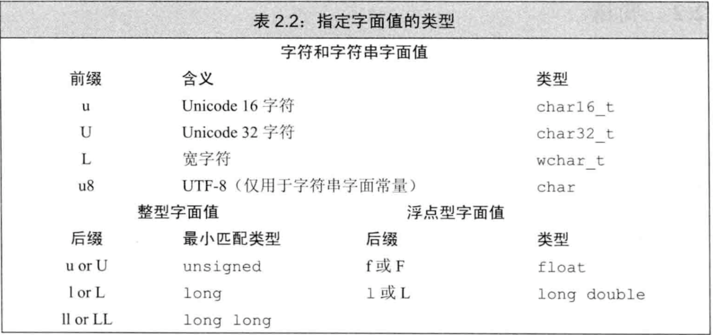

# the basics

## 基本数据类型

* 算术类型和空类型，算术类型分为整型和浮点型
* bool,char,wchar\_t,char16\_t,char32\_t,short,int,long,long long,float,double,long double
* bool型，非0为true,0为false

### signed与unsigned

* 除bool和扩展字符型（wchar\_t,char16\_t,char32\_t）外，其**它整型都有signed与unsigned之分**
* signed类型 ，符号位1为负数，0为正数
* **当我们赋给无符号类型一个超出它表示范围的值时，结果是初始值对无符号类型表示数值总数取模后的余数**
  比如，unsigned char表示0-255,当我们将-1赋值给unsigned char时，其值为-1对256取模的余数为255
* **当我们赋给带符号类型一个超出它表示范围的值时，其结果是未定义的**
* char分为signed char与unsigned char,**不同环境下，char表示两者中的一种，可能为signed char,可能为unsigned char**
  所以使用char时应当明确的使用signed char,或者unsigned char,不要使用char,char与环境有关
* char,wchar\_t\(前缀L\)，char16\_t\(前缀u\),char32\_t\(前缀U\),utf-8的可以用前缀u8
* **带符号类型与不带符号类型在同一表达式时，带符号会转化为不带符号类型，也就是取模后的余数**

```c++
int a = -8;
unsigned int b=5;
//那么 a+b并不等于-3
```

## 字面值常量

* 整型与浮点型：20,024,0x14
* 字符与字符串字面值：'c', "hello world",其中字符串字面值是常量字符数组，编译器在每个字符串结尾处加一个'\0'，
  所以字符串字面值其长度比它实际的长度要多1
* 转义字符：
  * 如果\后面跟着的8进制数超过3个，只有前3个与\组成转义字符，“\1234"表示8制数123与字符’4‘
  * \x会用到跟着的所有字符
* 

## 定义与声明

* 变量声明：用于向程序表明变量的类型和名字。
* 变量定义：用于为变量分配存储空间，还可为变量指定初始值。程序中，变量有且仅有一个定义。
* 定义也是声明：当定义变量时我们声明了它的类型和名字。
* extern关键字：通过使用extern关键字声明变量名而不定义它。
* 在多个文件中使用的变量，必须只能在一个文件中定义，而在其它的文件中使用它之前必须有它的声明，通过extern关键字声明变量

```c++
// file_1.cc
// defines and initializes a const that is accessible to other files
extern const int bufSize = fcn();
//必须在定义时就加上extern关键字

// file_2.cc
extern const int bufSize; // uses bufSize from file_1
//其它文件的声明也必须加上extern
// uses bufSize defined in file_1
for (int index = 0; index != bufSize; ++index) {
 //...
}
```

* **非const的全局变量在整个程序中都可用**，因为它默认是extern的，
* **const的全局变量只在该定义它的文件中使用，其它文件要用，必须声明为extern**

```c++
// file_1.cc
// 定义
extern const int buffSize = 512;

// file_2.cc
// 声明变量，不能是定义
extern const int buffSize;
```

### 作用域

* 作用域中一旦声明了某个名字，它所嵌套的所有作用域中都能访问该名字
* **内部作用域会覆盖外部作用域的值**
* 如果函数有可能用到某全局变量，则不宜再下义一个同名的局部变量。

```c++
#include <iostream>

using namespace std;

int reused = 100;

int main() {
    cout << "reused = " << reused << endl;
    int reused = 50;
    cout << "reused = " << reused << endl;
    // ::表示没有名字的全局作用域
    cout << "reused = " << ::reused << endl;
    return 0;
}

// reused = 100
// reused = 50
// reused = 100
```

### 头文件与定义

* 一般情况下头文件不应当有定义，但是头文件可以定义类、值在编译时就已知道的const对象\(constexpr变量\)和 inline 函数
  * 这些实体可在多个源文件中定义，只要每个源文件中的定义是相同的。
  * 一般都把这样的 const 变量定义在头文件中。那样的话，无论该 const变量何时使用，编译器都能够看见其初始化。
  * 因为 const 对象默认为定义它的文件的局部变量，所以把它们的定义放在头文件中是合法的。
* 当我们在头文件中定义了 const 变量后，每个包含该头文件的源文件都有了自己的 const 变量，其名称和值都一样。
* 当该 const变量是用常量表达式初始化时，可以保证所有的变量都有相同的值。
* 如果 const变量不是用常量表达式初始化，那么它就不应该在头文件中定义。相反，和其他的变量一样，该 const
  变量应该在一个源文件中定义并初始化。应在头文件中为它添加 extern 声明，以使其能被多个文件共享.

## 引用

* **引用并非对象，它只是为一个已经存在的对象所起的的另一个名字**
* 定义引用时就必须用与该引用同类型的对象初始化
* 引用只是它绑定的对象的另一名字，作用在引用上的所有操作事实上都是作用在该引用绑定的对象
* 在实际程序中，引用主要用作函数的形式参数
* 当引用初始化后，只要该引用存在，它就保持绑定到初始化时指向的对象。不可能将引用绑定到另一个对象。
* **允许在一行中定义多个引用，每个引用标识符都必须以符号&开头**

```c++
int ival = 1024;
int &refVal = ival; // ok: refVal refers to ival
int &refVal2;       // error: a reference must be initialized
int &refVal3 = 10;  // error: initializer must be an object.
```

## 指针

* 指针与引用的区别
  * **指针本身也是一个对象**，允许对指针的赋值与拷贝
  * 指针的生命周期内可以先后指向不同的对象
  * 指针无须在定义时初始化
  * **因为引用不是对象，所以不能定义指向引用的指针**，但是可以定义指针的引用
* 指针状态
  * 指向一个对象
  * 指向紧邻对象所占空间的下一个位置
  * 空指针
  * 无效指针
* 空指针，尽可能用nullptr
* 建议初始化所有的指针,并且在可能的情况下，尽可能定义了对象后定义指向它的指针
* void\*指针，它可以存放任意对象的指针，但是我们对存于该指针的对象的类型是不知道的，非空的指针只能说明它
  指向一片内存，但是不能对该内存执行任何操作。
* 理解一条比较复杂的指针或引用的声明时，从右向左有利于理解它的真实含义,**并且一般情况下*和&应当和定义的变量标识符在一起**

```c++
int *p1, *p2;
// 修饰符与类型名写在一起，每行定义一个变量
int* p1;
int* p2;

int i = 42;
int *p;      // p是一个int型指针
int *&r = p; // r是一个对指针p的引用 
```

## Const

* const让变量变得不能修改的，必须在定义时被初始化

### 默认状态下，const对象仅在文件内部有效

* 当多个文件出现了同名的const变量时，其实等同于在不同的文件中分别定义了独立的变量
* **如果想要在不同的文件中共变const变量，应当加上extern关健字**

```c++
// file_1.cc
// defines and initializes a const that is accessible to other files
extern const int bufSize = fcn();
//必须在定义时就加上extern关键字

// file_2.cc
extern const int bufSize; // uses bufSize from file_1
//其它文件的声明也必须加上extern
// uses bufSize defined in file_1
for (int index = 0; index != bufSize; ++index) {
 //...
}
```

### const引用相关

* **const引用，即指向const对象的引用，可用相关的const或非const对象初始化，当然也可以用字面值初始化，只是不能通过别名修改对象了**
* **非const引用，即指向非const对象的引用，只能用非const对象初始化**
* 所谓指向常量的指针和引用，不过是指针或引用“自以为是”罢了，它们觉得自己指向了常量，所以自觉不去改变所指对象的值。

```c++
int i = 42;      //  legal for const references only
const int &r = 42;  //注意42是一个常量，所以可以初始化r,如果r前没加const,则不能用42初始化了
const int &r2 = r + i;
int &r3 = i; // 正确
const int a = 100;
int &r4 = a;// error,非const引用，只能用非const对象初始化
```

* 顶层const:任意的对象是常量，对于普通对象，对象不能变，对于指针，指针指向的对象是固定的

```c++
cont int a = 100;
int * cont pa = =&a;
```

* 底层const,与指针和引用等复合类型的基本类型部分有关

```c++
const int *pa= &a;
```

* 执行拷贝时，顶层const不受什么影响，而拷入与拷出的对象必须具有相同的底层const资格，或者两个对象的数据类型必须能够转型，一般来说非常量可以转换成常量，反之则不行

### const指针

* 常量指针必须初始化，而且一旦初始化完成则它的值(也就是存放在指针中的那个地址)就不能再改变了，不变的是指针的指向，而非指针指向对象的值

```c++
int main() {
    int i = 100;
    int i2 = 100;
    const int ci = 100;
    
    // 底层const 引用,可以用const/const对象，或字面值初始化
    const int &ri = 100;
    const int &ri1 = ci;
    const int &ri2 = i;

    // 指向非const对象的引用，必须用非const对象初始化
    int &ri3 = i;

    // 底层const 指针,可以用const/const对象的地址初始化
    const int *pi = &ci;
    const int *pi2 = &i;
    
    // 指向非const对象的指针，必须用非const对象的地址初始化
    int *pi3 = &i;
    
    // const指针，指向的
    int *const cp = &i;
    //cp = &i2;   // 非法，指针的指向不能变
    // int *const cp2 = &ci;   // 非法，指向非const对象的指针，必须用非const对象的地址初始化
    
    const int *const ccp = &i;
    const int *const ccp2 = &ci;

    int a = 0;
    int *const p1 = &a;  // 顶层const
    const int ca = 42;   // 顶层const
    const int *p2 = &ca; // 底层const
    const int *const p3 = p2;  // 左为底层，右为顶层
    const int &ra = ca;        // 因为引用对象，用于声明引用的都是底层const
    
    a = ci; // 顶层const，对拷贝没影响
    p2 = p3; // 都是底层const,可以执行拷贝
    
    // int *p = p3;  错误，p3包含底层const，而p没有不能赋值
    p2 = p3;         // 正确，都有底层const
    p2 = &a;         // 正确，int *能转换成const int *
    // int &ra = ca; 错误，普通的int&不能绑定到int 常量上
    const int &ra2 = a;  // const int &可以绑定到一个普通int 上
            
    return 0;
}
```

## typedef

* typedef 类型别名的一种方法，还可以用using

```c++
typedef double wages;
using wages =double;
```

```c++
typedef char *pstring;
// pstring的类型是
const pstring cstr = 0;  // cstr是指向char的常量指针 相当于 char *const
const pstring *ps;       // ps是一个指针，它指向char *const，所以相当于
```

## constexpr变量

* 常量表达式是值不会变\(本身是顶层const的\)且在编译期间就能得到计算结果的表达式
* constexpr，必须用常量表达式初始化，或者constexpr函数的返回值
* **constexpr指针，将指针置为顶层const**

```c++
constexpr int *a = nullptr;   //a 是一个指向int的常量指针，等价于int *const a = nullptr;
```

## auto变量 与decltype类型

* auto定义的变量必须有初始值
* 一条声明语句只能有一个基本数据类型，所以这一条语句中的所有变量的基本数据类型必须一样

```c++
auto i =0, *p = &i;    //i为整型，p为整型指针
auto sz = 0 ,pi = 3.14   //错误，两个数据类型不一致
```

### auto与复合类型

* **对于引用，auto返回的是引用的变量的类型，不包括引用本身，decltyp则包括引用本身**

```c++
int  i =0, &pi =i;
auto a= pi;            //int
decltype(pi) a = i;    //int& 必须初始化
```

* **auto会忽略顶层const,同时底层const则会保留下来，而decltype则会将顶层、底层const都保留下来**

```c++
int i = 0;
const int ci = i, &cr = ci;
auto b = ci ;          //int
auto c = cr ;          //int cr是ci的别名，cr是顶层const,被忽略了
auto d = &i;           //int *
auto e = &ci;          //const int * 底层const 指针
```

* 显式加上const与&可表示顶层const与引用

```c++
int i = 0;
const int ci = i, &cr = ci;
const auto f = ci;        // const int
auto &g =42;              //错误，非常量引用不能绑定到字面值
const auto &j = 42;       // 正确，可以为常量引用绑定字面值  底层const可以用常量初始化
```

### decltype

* **decltype(变量)，返回变量的类型，包括顶层const和引用本身在内**

```c++
const int ci = 0, &cj = ci;
decltype(ci) x = 0;  // const int
decltype(cj) y = x;  // const int &
decltype(cj) z;      // 错误，z是一个引用，必须初始化
```

* **decltype(表达式)返回表达式结果的类型**，如果表达式的结果为左值，则返回左值，如果表达式为右值，则返回为右值
* **如果表达式是解引用操作，则decltype将得到引用类型**

```c++
int i = 42, *p = &i,&r = i;
decltype (r+0) b; // 加法的结果是int,因而b是一个未初始化的int
decltype(*p)      // 错误，*p是一个表达式，但是解引用操作，所以类型为int&， 必须初始化
```

* 变量是种可以作为赋值语句左值的特殊形式，因而**decltype((variable))永远返回变量的引用类型**，而decltype(variable)返回变量类型 ，只有变量为引用类型时才返回引用类型

```c++
int i = 100;
decltype(i) a;     // 正确，a是一个未初始化的int
decltype((i)) b;   // 错误，b的类型为int&,必须初始化
```

## enum

```c++
enum Points {
    point2d = 2,
    point2w,point3d = 3,
    point3w
};
```

* 枚举变量类型，**其中，point2w,point3d的值是可以相同的，即都是3**，默认后一个比前一个的枚举类型的值大1
* 枚举类型定义后，可以定义该类型变量，但是只能用枚举类型赋值，不能用它默认的数值赋值

```c++
Points pt3d = point3d; //  ok: point3d is a Points enumerator
Points pt2w = 3;       //  error: pt2w initialized with int
pt2w = polygon;        //  error: polygon is not a Points enumerator
pt2w = pt3d;           //  ok: both are objects of Points enum type
```
