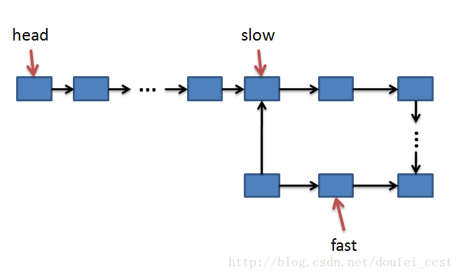

# LinkedList

-   淘汰算法
    -   先进先出 FIFO
    -   LFU (Least Frequently Used)
    -   LRU(Least Recently Used)
-   常用链表
    -   单链表
    -   双向链表
    -   循环链表
    -   双向循环

## 链表代码技巧

### 警惕指针丢失与内存泄漏

-   **在 a 和 b 之前插入 x 时，一定要先将 x 的 next 指向 b,然后再把 a 的 next 指向 x**
-   **删除链表节点时，记得手动释放内存空间**,需要 node 中的成员与指针都指为空

```java
    // 双向链表 移除最后一个节点
    private E unlinkLast(Node<E> node) {
        if (node == null) {
            return null;
        }
        Node<E> prev = node.prev;
        E e = node.value;
        node.value = null;
        node.prev = null;
        last = prev;
        if (prev == null) {
            first = null;
        } else {
            prev.next = null;
        }
        size--;
        return e;
    }
```

### 利表哨兵简化实现难度

-   **针对链表的插入,删除操作，需要对插入第一个节点和删除最后一个结点进行特殊处理**
-   引入哨兵节点，在任何时候，不管链表是不是为空，head 指针始终指向哨兵结点，这样增加与删除都可以同样代码操作了

### 留意边界条件

-   链表为空时
-   链表只有一个结点时
-   链表只有两个结点时
-   处理头结点与尾结点时

### 画图辅助思考

## 代码技巧

-   使用变量保存操作前的引用
-   while 循环的使用

```java
    public void linkBefore(Node<E> node, E e) {
        if (node == null) {
            return;
        }
        if (node == first) {
            linkHead(e);
            return;
        }
        Node<E> newNode = new Node<>(e, null);
        Node<E> p = first;
        // node 肯定不等于 first
        while (p != null && p.next != node) {
            p = p.next;
        }
        if (p == null) {
            // node不在链表内
            return;
        }
        newNode.next = p.next;
        p.next = newNode;
    }
```

## 常见的问题

### 判断链表是否有环



- 采用快慢指针，快每次走两步，慢每次走一步
- 如果有环，肯定fast先走入环，slow后进入环
- 每迭代一次，fast和slow之间的距离就会多1，当达到环的长度的时候，fast就和slow重合了

```java
fun hasCircle(node: Node?): Boolean {
    if (node?.next == null) {
        return false
    }
    var fast = node
    var slow = node
    while (fast?.next?.next != null) {
        fast = fast.next?.next
        slow = slow?.next
        if (fast == slow) {
            return true
        }
    }
    return false
}
```