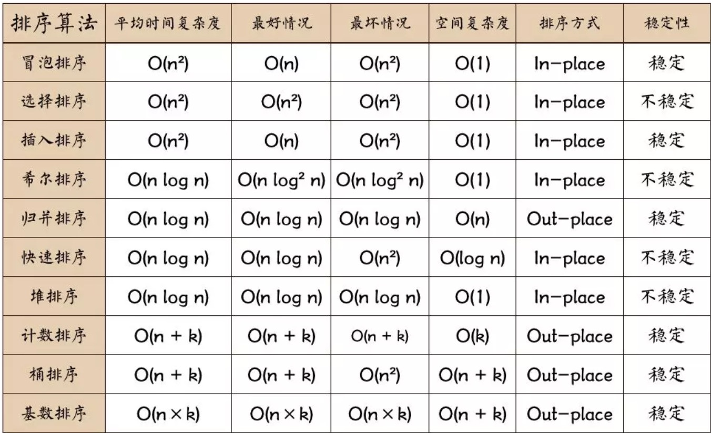

# Sort

-   [十大经典排序算法](https://www.cnblogs.com/onepixel/articles/7674659.html)
-   [动态图解十大经典排序算法](https://mp.weixin.qq.com/s/HQg3BzzQfJXcWyltsgOfCQ)
-   

-   [常见算法](#常见算法)
-   [分析排序算法](#分析排序算法)
    -   [执行效率](#执行效率)
    -   [内存消耗](#内存消耗)
    -   [稳定性](#稳定性)
-   [冒泡排序](#冒泡排序)
-   [插入排序](#插入排序)
-   [选择排序](#选择排序)
-   [归并排序](#归并排序)
-   [快速排序](#快速排序)
-   [计数排序](#计数排序)
-   [桶排序](#桶排序)
-   [基数排序](#基数排序)

## 常见算法

-   冒泡，插入，选择 O(n*n) 基于比较
-   快速，归并 O(nlogn) 基于比较
-   桶，计数，基数 O(n)

## 分析排序算法

### 执行效率

-   最好/最坏/平均时间复杂度
-   时间复杂度的系数，常数，低阶
-   比较次数与交换次数

### 内存消耗

-   原生排序算法，空间复杂度为 O(1)的算法

### 稳定性

-   如果待排序中存在值相等的元素，经过排序之后，相等元素之间原有的先后顺序不变
-   比如要对订单先按金额后按时间排序
    -   先对订单按时间先后排序
    -   再用稳定排序算法，对订单按金额排序

## 冒泡排序

-   冒泡排序是一种简单的排序算法。它重复地走访过要排序的数列，一次比较两个元素，如果它们的顺序错误就把它们交换过来。走访数列的工作是重复地进行直到没有再需要交换，也就是说该数列已经排序完成
-   原地排序算法
-   稳定排序算法
-   时间复杂度
    -   最好，本身就是有序的，只要进行一次冒泡，也就是两两比较，没有交换 O(n)
    -   最坏，完全倒序,n 次冒泡，O(n\*n)
    -   平均时间复杂度 O(n\*n)

## 插入排序

-   假设数据中前 i 个已经有序，然后将第 i +1 个有序部分从后向遍历，插入合适的位置
-   最好：O(n), 每次从后向前都只要比较一次就能确定插入的位置
-   最坏：O(n\*n), 完全倒序
-   平均：O(n\*n)
-   原地排序算法
-   稳定排序算法

## 选择排序

-   假设前 i 个有序了，然后将剩下数据中最小加到有序的后面
-   因为无论是否有序，都要选择最小的, 比较的次数与原数据是否有序无关
-   最好/最坏/平均 O(n\*n
-   原地排序
-   非稳定排序

## 归并排序

-   如果要排序数组，先把数组从中间分成前后两个部分，然后对前后分别排序，最后将前后两部分合在一起，
    然后对整个排序过程进行递归操作
-   时间复杂度：O(n\*logn), 采用递归分析时间复杂度
-   空间复杂度：O(n),任何时候最多只有一次合并操作，而最多是长度为 n 的临时空间，所以 O(n)
-   稳不稳定只需要关注 merge 操作，只要合并时，先插入前面的数据就可以了，所以是**稳定排序**

## 快速排序

-   排序思想：
    -   如果要排序数组 p 与 r 之前的一组数据，选择 p 与 r 之间任意一个数据作为 pivot
    -   遍历 p 与 r 之前的一组数据，将小于 pivot 的放到左边，将 pivot 放到中间
    -   经过这一布骤后，p 与 r 之间的数组分成了 3 部分，p 与 q-1 小于 pivot,中间是 pivot,后面的 q+1 与 r 之间的是在于 pivot 的
    -   对整个排序操作递归操作
-   平均：O(n\*logn)
-   最坏：比如本来有序了，选择最后一个作为 pivot,每次分区两个区间不均等，进行大约 n 次分区操作，而每次扫描
    大约 n/2 个元素，退化为 O(n\*n)
-   不稳定排序

```java
    static int partition(int[] a, int left, int right) {
        int pivot = a[left];
        while (left < right) {
            while (left < right && a[right] >= pivot) {
                right--;
            }
            if (left < right) {
                a[left++] = a[right];
            }
            while (left < right && a[left] <= pivot) {
                left++;
            }
            if (left < right) {
                a[right--] = a[left];
            }
        }
        a[left] = pivot;
        return left;
    }
```

## 计数排序

-   计数排序的核心在于将输入的数据值转化为键存储在额外开辟的数组空间中。 作为一种线性时间复杂度的排序，**计数排序要求输入的数据必须是有确定范围的整数**
-   算法实现：
    -   找出待排序的数组中最大和最小的元素；
    -   统计数组中每个值为 i 的元素出现的次数，存入数组 C 的第 i 项；
    -   对所有的计数累加（从 C 中的第一个元素开始，每一项和前一项相加）；
    -   反向填充目标数组：将每个元素 i 放在新数组的第 C(i)项，每放一个元素就将 C(i)减去 1
-   最好/最坏/平均：O(n)
-   稳定排序

```java
        // 找出最大最小值
        int range = max - min + 1;
        int[] b = new int[range];
        for (int i = 0; i < range; i++) {
            b[i] = 0;
        }
        // 统计每个值出现的次数
        for (int value : a) {
            b[value - min]++;
        }
        // 前后两两相加
        for (int i = 1; i < size; i++) {
            b[i] = b[i] + b[i - 1];
        }
        // 从数组中取一个数k, k-min在b中对应值m,说明a中有m个值<=k,所以k对应的位置为m-1
        int[] c = new int[size];
        for (int i = size - 1; i >= 0; i--) {
            int index = b[a[i] - min] - 1;
            c[index] = a[i];
            b[a[i] - min]--;
        }
```

```java
        int max = a[0];
        int min = a[0];
        for (int i = 1; i < size; i++) {
            if (a[i] > max) {
                max = a[i];
            }
            if (a[i] < min) {
                min = a[i];
            }
        }
        // 找出最大最小值
        int range = max - min + 1;
        int[] b = new int[range];
        for (int i = 0; i < range; i++) {
            b[i] = 0;
        }
        // 统计每个值出现的次数
        for (int value : a) {
            b[value - min]++;
        }
        // 另外一种思路，比较适用于int等比较
        // b每一个位置i对应的值b[i]不为0，说明min+i出现了b[i]次
        // 只要按顺序填上对应个数的值就可以了
        int[] result = new int[size];
        int j = 0;
        for (int i = 0; i < range; i++) {
            int count = b[i];
            for (int k = 0; k < count; k++) {
                result[j++] = min + i;
            }
        }
```

## 桶排序

-   桶排序是计数排序的升级版。它利用了函数的映射关系，高效与否的关键就在于这个映射函数的确定。
-   桶排序 (Bucket sort)的工作的原理：假设输入数据服从均匀分布，将数据分到有限数量的桶里，每个桶再分别排序，可以使用任何排序方式
-   算法描述
    -   人为设置一个 BucketSize，作为每个桶所能放置多少个不同数值（例如当 BucketSize==5 时，该桶可以存放｛1,2,3,4,5｝这几种数字，但是容量不限，即可以存放 100 个 3）；
    -   遍历输入数据，并且把数据一个一个放到对应的桶里去；
    -   对每个不是空的桶进行排序，可以使用其它排序方法，也可以递归使用桶排序；
    -   从不是空的桶里把排好序的数据拼接起来。
-   **如果递归使用桶排序为各个桶排序，则当桶数量为 1 时要手动减小 BucketSize 增加下一循环桶的数量，否则会陷入死循环，导致内存溢出**
-   稳定排序

## 基数排序

-   对于数据要能够分割出每一位，并且对于数据， a 数据的高位比 b 大，那么低位就不用比较了
-   每一位的数据的范围不能太大，否则就不能够使用 O(n)的比较方法了
-   经常会和稳定排序联使使用
-   O(n)
-   稳定排序
-   可能要进行补位
-   **从高位到低位，从低位到高位**
-   示例：对 10 万个手机号码按从小到大排序
    -   先最低位稳定排序
    -   然后倒数第二位，然后倒数第三位，直到最高位稳定排序
    -   最后的排序结果就是从小到大的
