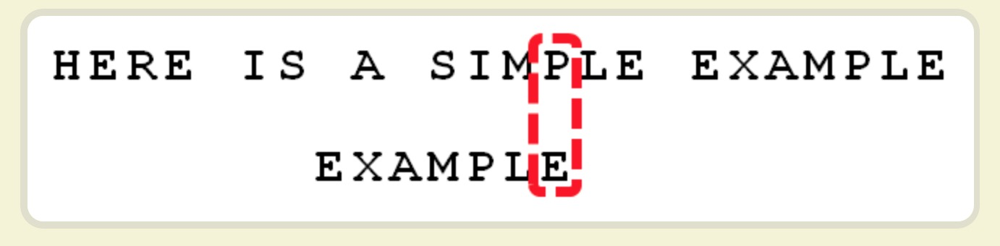
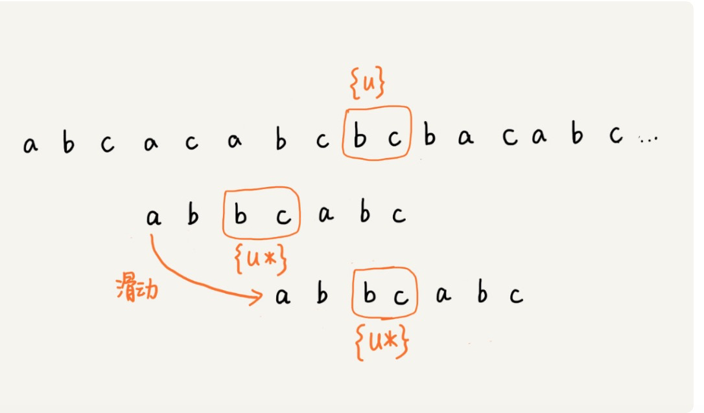
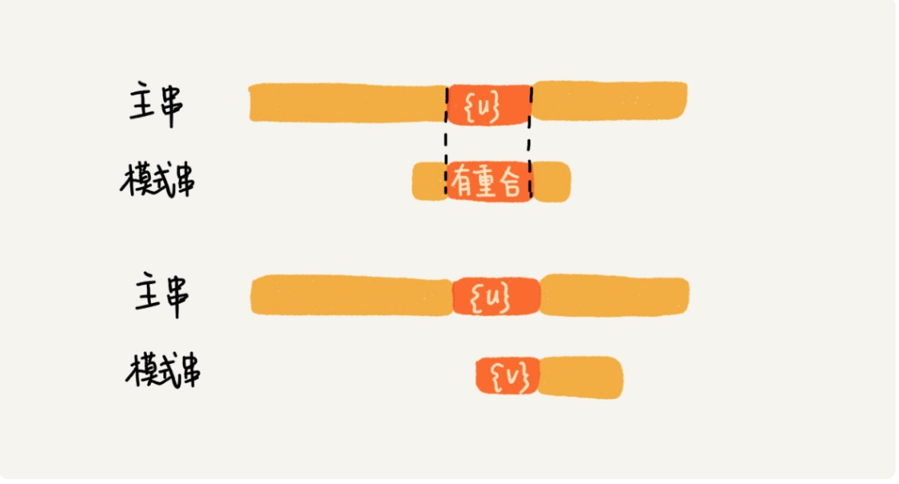

# Strings

## BF

- 暴力搜索算法

## RK 算法

-   模式串长度为m,主串长度为n，主串中会有n-m+1个长度为m的子串
-   与BF不同，不进行字符的对比，对n-m+1个子串求哈希值，然后与模式串哈希值比较大小
-   如果hash不同，肯定不相等，如果hash相同，可能相等，再进行比较
-   哈希算法可以考虑进制法
    -   比如对于只有英文字符的，a为1,b为26,c为26*26,像10进制一样算整个字符串的进制
    -   并且如果只移动一位的话，前后两个的hash算法是可以部分复用的

## BM算法

-   效率最高的算法
-   **比较时，从后向前比较**
-   [BM算法](https://time.geekbang.org/column/article/71525)
-   [坏字符与好后缀](http://www.ruanyifeng.com/blog/2013/05/boyer-moore_string_search_algorithm.html)

## 坏字符

-   从后向前比较，遇到一个不匹配的字符时，移动的长度算法如下
    -   **下标都是从0开始**
    -   **都是字符在模式串的下标**
    -   主串中不匹配字符对应在模式串中的位置记为si
    -   如果坏字符存在模式串中下标记为xi，如果坏字符在模式串中不存在，记为-1
    -   **如果坏字符在模式串中有多处出现，选择模式串中最靠右的那个**
    -   移动位置si-xi

-   p为坏字符，对应E在模式串中位置为6
-   p在模式串中，上一次出现的位置为4
-   所以移动的距离为6-4= 2,让两个p对齐

## 好后缀

-   从后向前比较，如果有部分后缀子串在模式串中与子串中匹配，这个后缀子串叫作好后缀
-   **如果好后缀在子串中出现过不只一次**，那么要移动模式串，让模式串上一次出现的好后缀字符位置与主串的好后缀对齐

-   如果好后缀{u}只在模式串末尾出现过一次，那么只要模式串与主串的{u}有重合时，就不会发生匹配，**但是当好后缀{u}的后缀子串与模式串的前缀子串有重合时，可能发生匹配**

## 坏字符与好后缀的选择

-   分别计算坏字符与好后缀需要移动的位数，取两者中间较大的
