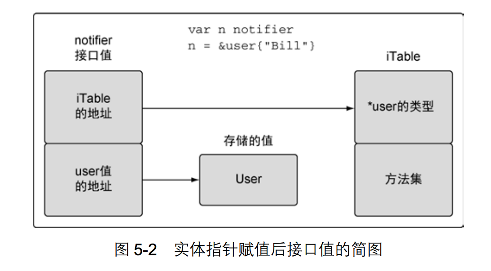

# 接口

- [接口基本](#接口基本)
- [实现接口](#实现接口)
- [接口值](#接口值)
- [类型转换](#类型转换)
    - [Comma-ok断言](#comma-ok断言)
    - [switch语法](#switch语法)
- [接口技巧](#接口技巧)

## 接口基本

- **接口是合约，接口类型具体描述了一系列方法的集合**，一个实现了这些方法的具体类型是这个接口类型的实例。
- 接口内嵌,语法和结构体匿名字段相似

```golang

type Writer interface {
    Write(p []byte) (n int, err error)
}

type Reader interface {
    Read(p []byte) (n int, err error)
}
type Closer interface {
    Close() error
}

type ReadWriter interface {
    Reader
    Writer
}
type ReadWriteCloser interface {
    Reader
    Writer
    Closer
}

type ReadWriter interface {
    Read(p []byte) (n int, err error)
    Writer
}
```

- 匿名接⼝可⽤作变量类型，或结构成员

```golang
type Tester struct {
    // Tester内部有一个接口成员
    s interface {
        String() string
    }
}

type User struct {
    id int
    name string
}

func (self *User) String() string {
    return fmt.Sprintf("user %d, %s", self.id, self.name)
}

func main() {
    // *User实现了上面的匿名接口，所以这里可以赋值
    t := Tester{&User{1, "Tom"}}
    fmt.Println(t.s.String())
}
```

## 实现接口

- 实现接口，必须实现接口所包含的所有的方法
- **空接⼝ interface{} 没有任何⽅法签名，也就意味着任何类型都实现了空接⼝。**
- 可以在T类型变量上调用接受器为T指针的方法仅是一个语法糖，T类型的值不拥有所有T指针的方法,下面的例子中，*Person才是fmt.Stringer接口类型，Person并不是fmt.Stringer类型

```golang
type Person struct {
    Name string
    ID   string
    age  int
}

func (p *Person) String() string {
    var buf bytes.Buffer
    buf.WriteByte('{')
    buf.WriteString("Name:")
    buf.WriteString(p.Name)
    buf.WriteByte(' ')
    buf.WriteString("ID:")
    buf.WriteString(p.ID)
    buf.WriteByte('}')
    return buf.String()
}

// compile error: cannot call pointer method on datastruct.Person literal
// cannot take the address of datastruct.Person literal
//  datastruct.Person{Name: "Keylen", ID: "3"}是一个局部对象，不是一个变量，所以不能取地址，所以这里是不行的

// var c = datastruct.Person{Name: "Keylen", ID: "3"}.String()
// fmt.Println(c)
```

## 接口值

- 接口值是一个两个字长度的数据结构
    - **第一个字包含一个指向内部表的指针**。这个内部表叫作iTable，包含了所存储的值的类型信息。**iTable包含了已存储的值的类型信息以及与这个值相关联的一组方法。**
    - **第二个字是一个指向所存储值的指针**。将类型信息和指针组合在一起，就将这两个值组成了一种特殊的关系。
- 接口值，由两个部分组成，一个具体的类型和那个类型的值，**只有具体的类型和类型的值都为空时，接口对象才为nil**



```golang
// w 为nil
var w io.Writer
// true
fmt.Println(w == nil)
// <nil>
fmt.Printf("%T\n", w)

w = os.Stdout
// false
fmt.Println(w == nil)
//*os.File
fmt.Printf("%T\n", w)

w = new(bytes.Buffer)
// false
fmt.Println(w == nil)
//*bytes.Buffer
fmt.Printf("%T\n", w)

w = nil
// true
fmt.Println(w == nil)
//<nil>
fmt.Printf("%T\n", w)
```

- **一个包含nil指针的接口不是nil接口**

```golang
const debug = true

func main() {
    var buf  *bytes.Buffer
    if debug {
        buf = new(bytes.Buffer) // enable collection of output
    }
    // NOTE: subtly incorrect!
    // 虽然buf是一个nil指针，但是对于io.Writer来说这并不是一个nil的接口值
    // 调用时会出现panic
    f(buf)
    if debug {
        // ...use buf...
    }
}

// If out is non-nil, output will be written to it.
func f(out io.Writer) {
    if out != nil {
        out.Write([]byte("done!\n"))
    }
}
```

```golang
// 接口值默认为nil
var buf io.Writer
if debug {
    buf = new(bytes.Buffer) // enable collection of output
}
f(buf) // OK
```

## 类型转换

- **具体类型之间的转换不存在隐式转换，必须手动转换**

```golang
var a int32 = 0

// 编译不通过的，必须显示转换
// var b int64 = a
b := int64(a)
```

- **普通类型向接口类型的转换是隐式的，接口类型向普通类型转换需要类型断言**

### Comma-ok断言

- 语法：**value, ok := element.(T)**。element必须是接口类型的变量，T是普通类型。如果断言失败，ok为false，否则ok为true并且value为变量的值
- Comma-ok断言还支持另一种简化使用的方式：**value := element.(T)。但这种方式不建议使用，因为一旦element.(T)断言失败，则会产生运行时错误**

```golang
type Html []interface{}

func main() {
    html := make(Html, 5)
    html[0] = "div"
    html[1] = "span"
    html[2] = []byte("script")
    html[3] = "style"
    html[4] = "head"
    for index, element := range html {
        if value, ok := element.(string); ok {
            fmt.Printf("html[%d] is a string and its value is %s\n", index, value)
        } else if value, ok := element.([]byte); ok {
            fmt.Printf("html[%d] is a []byte and its value is %s\n", index, string(value))
        }
    }
}
```

### switch语法

```golang
func sqlQuote(x interface{}) string {
    switch x := x.(type) {
    case nil:
        return "NULL"
    case int, uint:
        return fmt.Sprintf("%d", x) // x has type interface{} here.
    case bool:
        if x {
            return "TRUE"
        }
        return "FALSE"
    case string:
        return sqlQuoteString(x) // (not shown)
    default:
        panic(fmt.Sprintf("unexpected type %T: %v", x, x))
    }
}
```

## 接口技巧

- 让编译器检查，以确保某个类型实现接⼝

```golang
var _ fmt.Stringer = (*Data)(nil)
```

- **某些时候，让函数直接 "实现" 接⼝能省不少事**

```golang
type Tester interface {
    Do()
}

type FuncDo func()

func (self FuncDo) Do() { self() }

func main() {
    var t Tester = FuncDo(func() { println("Hello, World!") })
    t.Do()
}

type HandlerFunc func(ResponseWriter, *Request)

// HandlerFunc实现了http.Handler接口
func (f  HandlerFunc) ServeHTTP(w ResponseWriter, r *Request) {
    f(w, r)
}
```
