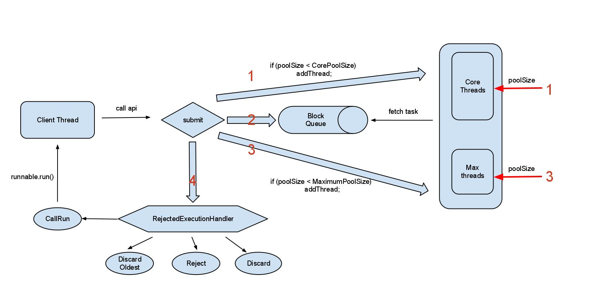

# Concurrent包

## 从任务中返回值

- Runnable执行独立的任务，但不返回值，如果要返回值，使用Callable
- Callable一般用ExecutorService.submit\(\)方法调用它,submit产生Future对象
- 可以用isDone\(\)来检测Future是否完成
- 也可以直接调用get\(\)，但是会阻塞线程

```java
class Task implements Callable<String> {
  private int id;
  public Task(int id) {
    this.id = id;
  }

  public String call(){
    return "result of Task" + id;
  }
}
ExecutorService exec = Executors.newCachedThreadPool();
List<Future<String>> list = new ArrayList<>();
for(int i = 0; i < 10; ++i) {
  list.add(exec.submit(new Task(i)));
}
```

## ExecutorService

- [ExecutorService-10个要诀和技巧](http://ifeve.com/executorservice-10-tips-and-tricks/)

### shutdown

- 发起一个关闭请求，**已提交的任务会执行，但不会接受新的任务请求了。**
- 这个方法**不会等待已提交的任务全部执行完成**，如果你希望这样做，可以使用awaitTermination方法

### shutdownNow

- **尝试去停掉所有正在执行的任务，但不一定会成功**，一般情况下会调用interrupt，但是如果线程本身没有处理interrupt的话，任务是不会停止的
- 取消等待中的任务，返回等待执行的任务 的list
- 不会等待执行中的任务停止，如果你希望这样做，可以使用awaitTermination方法

### isShutdown

- 线程池是否被关闭了

### isTerminated

- 线程池是否结束了
- 首先必须调用shutdown/shutdownNow，其次所有的任务都结束了才会返回true

### awaitTermination

- 调用此方法，在shutdown请求发起后，除非以下任何一种情况发生，否则当前线程将一直到阻塞
    - 所有任务执行完成
    - 超时
    - 当前线程被中断

### execute与submit的区别

- 接收的参数不一样
- submit有返回值，而execute没有
- **submit方便Exception处理**
    - 无论在task里抛出checked或者unchecked exception
    - 如果使用execute来执行这个任务，那么异常会走到uncaught exception handler
    - 如果使用submit来执行这个任务，那么异常会被包装成ExecutionException，并且Future.get()会再次抛次这个exception
    如果我们希望外面的调用者能够感知到这些exception并且做处处理，应当使用submit

## ThreadPoolExecutor

```java
public ThreadPoolExecutor(int corePoolSize,int maximumPoolSize,long keepAliveTime,
    TimeUnit unit,BlockingQueue<Runnable> workQueue,
    ThreadFactory threadFactory,RejectedExecutionHandler handler) {
    //...
}
```

- **corePoolSize**:核心线程数，**默认情况下核心线程会一直存活，即使处于闲置状态也不会受存keepAliveTime限制**。除非将allowCoreThreadTimeOut设置为true。
- **maximumPoolSize**: **线程池所能容纳的最大线程数**。超过这个数的线程将被阻塞。当任务队列为没有设置大小的LinkedBlockingDeque时，这个值无效。
- **keepAliveTime**:非核心线程的闲置超时时间，超过这个时间就会被回收
- **unit**:指定keepAliveTime的单位
- **workQueue**:线程池中的任务队列,常用的有三种队列，SynchronousQueue,LinkedBlockingDeque,ArrayBlockingQueue。
- **threadFactory**:线程工厂，提供创建新线程的功能
- **RejectedExecutionHandler**:当线程池中的资源已经全部使用，添加新线程被拒绝时，会调用RejectedExecutionHandler的rejectedExecution方法

### execute策略

- [ThreadPoolExecutor几点使用建议](https://yq.aliyun.com/articles/14592)
- [一心多用多线程-线程池ThreadPoolExecutor](http://blog.csdn.net/hayre/article/details/53291712)



- 当前正在运行的线程的数目小于corePoolSize，会走上图的第一步，直接new一个Thread，并将runnable作为线程的初始任务，立马执行
- 当提交的任务数超过了corePoolSize，就进入了上图第二步操作，会尝试将当前的runable加到一个block queue中
    - 如果加入成功，此时即使工作线程数目小于maxnumPoolSize,也是不会创建线程的
    - 如果blockqueue是个有界队列并且队列满了，加入失败就会走上图的第三步，此时如果poolSize < maximumPoolsize时，会尝试new 一个Thread的进行救急处理，立马执行对应的runnable任务
- 如果第三步救急方案也无法处理了，就会走到第四步执行reject操作

### 任务的排队

- 如果运行的线程少于 corePoolSize，则 Executor 始终首选添加新的线程，而不进行排队。
- 如果运行的线程等于或多于 corePoolSize，则 Executor 始终首选将请求加入队列，而不添加新的线程。
- 如果无法将请求加入队列，则创建新的线程，除非创建此线程超出 maximumPoolSize，在这种情况下，任务将被拒绝

### BlockingQueue

- ArrayBlockingQueue :  有界的数组队列
- LinkedBlockingQueue : 可支持有界/无界的队列，使用链表实现
- PriorityBlockingQueue : 优先队列，可以针对任务排序
- SynchronousQueue : 队列长度为1的队列，和Array有点区别就是：client thread提交到block queue会是一个阻塞过程，直到有一个worker thread连接上来poll task

- 直接提交。工作队列的默认选项是SynchronousQueue，它将任务直接提交给线程而不保持它们。在此，如果不存在可用于立即运行任务的线程，则试图把任务加入队列将失败，因此会构造一个新的线程。此策略可以避免在处理可能具有内部依赖性的请求集时出现锁。**直接提交通常要求无界maximumPoolSizes 以避免拒绝新提交的任务**。当命令以超过队列所能处理的平均数连续到达时，此策略允许无界线程具有增长的可能性。
- 无界队列。使用无界队列（例如，不具有预定义容量的 LinkedBlockingQueue）将导致在所有 corePoolSize线程都忙时新任务在队列中等待。这样，**创建的线程就不会超过 corePoolSize，因此，maximumPoolSize的值也就无效了。**当每个任务完全独立于其他任务，即任务执行互不影响时，适合于使用无界队列；例如，在 Web页服务器中。这种排队可用于处理瞬态突发请求，当命令以超过队列所能处理的平均数连续到达时，此策略允许无界线程具有增长的可能性。
- 有界队列。当使用有限的 maximumPoolSizes 时，有界队列（如ArrayBlockingQueue）有助于防止资源耗尽，但是可能较难调整和控制。队列大小和最大池大小可能需要相互折衷：**使用大型队列和小型池可以最大限度地降低CPU 使用率、操作系统资源和上下文切换开销，但是可能导致人工降低吞吐量**。如果任务频繁阻塞（例如，如果它们是 I/O边界），则系统可能为超过您许可的更多线程安排时间。**使用小型队列通常要求较大的池大小，CPU使用率较高，但是可能遇到不可接受的调度开销，这样也会降低吞吐量**

### RejectExecutionHandler

- Reject 直接抛出Reject exception
- Discard 直接忽略该runnable，不可取
- DiscardOldest 丢弃最早入队列的的任务
- CallsRun 直接让原先的client thread做为worker线程，进行执行

### ThreadFactory

- 每个ExecutorService的创建方法都被重载为接受一个ThreadFactory对象，而这个对象被用来创建对象

```java
public class DaemonThreadFactory implements ThreadFactory {
        public Thread newThread(Runnable r) {
              Thread t = new Thread();
              t.setDaemon(true);
              return t;
        }
}

ExecutorService exec = Executors.newCachedThreadPool(new DaemonThreadFactory());
```