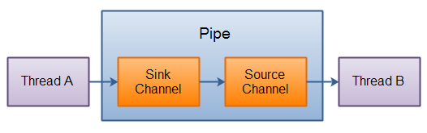

# NIO进阶

- [相关资料](#相关资料)
- [FileChannel](#filechannel)
    - [打开FileChannel](#打开filechannel)
    - [读写FileChannel](#读写filechannel)
    - [关闭](#关闭)
    - [position](#position)
    - [size](#size)
    - [FileChannel的truncate方法](#filechannel的truncate方法)
    - [FileChannel的force方法](#filechannel的force方法)
- [SocketChannel](#socketchannel)
    - [打开/关闭](#打开关闭)
    - [读写SocketChannel与其它Channel一样](#读写socketchannel与其它channel一样)
    - [非阻塞模式](#非阻塞模式)
        - [connect()](#connect)
        - [write()](#write)
        - [read()](#read)
- [ServerSocketChannel](#serversocketchannel)
    - [打开/关闭ServerSocketChannel](#打开关闭serversocketchannel)
    - [监听新进来的连接](#监听新进来的连接)
    - [ServerSocketChannel非阻塞模式](#serversocketchannel非阻塞模式)
- [DatagramChannel](#datagramchannel)
    - [打开 DatagramChannel](#打开-datagramchannel)
    - [发送／接受数据](#发送／接受数据)
    - [连接到特定的地址](#连接到特定的地址)
- [Pipe](#pipe)
    - [创建管道](#创建管道)
    - [写数据](#写数据)
    - [读数据](#读数据)
- [Path](#path)
    - [创建一个Path](#创建一个path)
    - [绝对路径](#绝对路径)
    - [相对路径](#相对路径)
    - [常见其它用法](#常见其它用法)
    - [normalize()](#normalize)
- [Files](#files)
    - [Files.exists()](#filesexists)
    - [创建文件夹](#创建文件夹)
    - [文件拷贝](#文件拷贝)
    - [覆写文件](#覆写文件)
    - [文件移动](#文件移动)
    - [文件删除](#文件删除)
    - [文件遍例](#文件遍例)
    - [文件查找](#文件查找)
    - [文件递归删除](#文件递归删除)

## 相关资料

- [Java NIO系统教程](http://ifeve.com/java-nio-all/)

## FileChannel

### 打开FileChannel

```java
 * @see java.io.FileInputStream#getChannel()
 * @see java.io.FileOutputStream#getChannel()
 * @see java.io.RandomAccessFile#getChannel()
```

### 读写FileChannel

- 使用ByteBuffer读取文件内容

```java
RandomAccessFile aFile = new RandomAccessFile("data/nio-data.txt", "rw");
FileChannel inChannel = aFile.getChannel();

// 读
ByteBuffer buf = ByteBuffer.allocate(48);
int bytesRead = inChannel.read(buf);

// 写
String newData = "New String to write to file..." + System.currentTimeMillis();
ByteBuffer bufWrite = ByteBuffer.allocate(480);
bufWrite.clear();
bufWrite.put(newData.getBytes());
bufWrite.flip();
while(bufWrite.hasRemaining()) {
    channel.bufWrite(buf);
}
```

### 关闭

```java
channel.close();
```

### position

- 有时可能需要在FileChannel的某个特定位置进行数据的读/写操作。可以通过调用position()方法获取FileChannel的当前位置。
- 可以通过调用position(long pos)方法设置FileChannel的当前位置。
- 如果将位置设置在文件结束符之后，然后试图从文件通道中读取数据，读方法将返回-1
- 如果将位置设置在文件结束符之后，然后向通道中写数据，文件将撑大到当前位置并写入数据。这可能导致“文件空洞”，磁盘上物理文件中写入的数据间有空隙

```java
long pos = channel.position();
channel.position(pos +123);
```

### size

- FileChannel实例的size()方法将返回该实例所关联文件的大小。

```java
long fileSize = channel.size();
```

### FileChannel的truncate方法

- 可以使用FileChannel.truncate()方法截取一个文件。截取文件时，文件将指定长度后面的部分将被删除。

```java
channel.truncate(1024);
这个例子截取文件的前1024个字节。
```

### FileChannel的force方法

- FileChannel.force()方法将通道里尚未写入磁盘的数据强制写到磁盘上。出于性能方面的考虑，操作系统会将数据缓存在内存中，所以无法保证写入到FileChannel里的数据一定会即时写到磁盘上。要保证这一点，需要调用force()方法。
- force()方法有一个boolean类型的参数，指明是否同时将文件元数据（权限信息等）写到磁盘上。

```java
channel.force(true);
```

## SocketChannel

### 打开/关闭

```java
SocketChannel socketChannel = SocketChannel.open();
socketChannel.connect(new InetSocketAddress("http://jenkov.com", 80));

socketChannel.close();
```

### 读写SocketChannel与其它Channel一样

### 非阻塞模式

- 可以设置 SocketChannel 为非阻塞模式.设置之后，就可以在异步模式下调用connect(), read() 和write()了。

#### connect()

如果SocketChannel在非阻塞模式下，此时调用connect()，该方法可能在连接建立之前就返回了。为了确定连接是否建立，可以调用finishConnect()的方法。

```java

socketChannel.configureBlocking(false);
socketChannel.connect(new InetSocketAddress("http://jenkov.com", 80));
while(! socketChannel.finishConnect() ){
    //wait, or do something else...
}
```

#### write()

- 非阻塞模式下，write()方法在尚未写出任何内容时可能就返回了。所以需要在循环中调用write()。

#### read()

- 非阻塞模式下,read()方法在尚未读取到任何数据时可能就返回了。所以需要关注它的int返回值，它会告诉你读取了多少字节。

## ServerSocketChannel

### 打开/关闭ServerSocketChannel

```java
ServerSocketChannel serverSocketChannel = ServerSocketChannel.open();
serverSocketChannel.socket().bind(new InetSocketAddress(9999));
serverSocketChannel.close();
```

### 监听新进来的连接

- 通过 ServerSocketChannel.accept() 方法监听新进来的连接。
- 当 accept()方法返回的时候,它返回一个包含新进来的连接的 SocketChannel。
- 因此, accept()方法会一直阻塞到有新连接到达。

```java
// 通常不会仅仅只监听一个连接,在while循环中调用 accept()方法. 如下面的例子：

while(true){
    SocketChannel socketChannel = serverSocketChannel.accept();
    //do something with socketChannel...6
}
```

### ServerSocketChannel非阻塞模式

- ServerSocketChannel可以设置成非阻塞模式。
- 在非阻塞模式下，accept() 方法会立刻返回，**如果还没有新进来的连接,返回的将是null。 因此，需要检查返回的SocketChannel是否是null**

```java
ServerSocketChannel serverSocketChannel = ServerSocketChannel.open();
serverSocketChannel.socket().bind(new InetSocketAddress(9999));
serverSocketChannel.configureBlocking(false);
while(true){
    SocketChannel socketChannel = serverSocketChannel.accept();
    if(socketChannel != null){
         //do something with socketChannel...
    }
}
```

## DatagramChannel

### 打开 DatagramChannel

```java
DatagramChannel channel = DatagramChannel.open();
channel.socket().bind(new InetSocketAddress(9999));

// 这个例子打开的 DatagramChannel可以在UDP端口9999上接收数据包。
```

### 发送／接受数据

- 通过receive()方法从DatagramChannel接收数据，receive()方法会将接收到的数据包内容复制到指定的Buffer. 
 **如果Buffer容不下收到的数据，多出的数据将被丢弃**

```java
ByteBuffer buf = ByteBuffer.allocate(48);
buf.clear();
channel.receive(buf);
```

- 通过send()方法从DatagramChannel发送数据

```java
String newData = "New String to write to file..." + System.currentTimeMillis();
ByteBuffer buf = ByteBuffer.allocate(48);
buf.clear();
buf.put(newData.getBytes());
buf.flip();
int bytesSent = channel.send(buf, new InetSocketAddress("jenkov.com", 80));
```

### 连接到特定的地址

- **可以将DatagramChannel“连接”到网络中的特定地址的**。由于UDP是无连接的，连接到特定地址并不会像TCP通道那样创建一个真正的连接。而是锁住DatagramChannel ，**让其只能从特定地址收发数据**。
- 当连接后，也可以使用read()和write()方法，就像在用传统的通道一样。只是在数据传送方面没有任何保证

```java
channel.connect(new InetSocketAddress("jenkov.com", 80));

int bytesRead = channel.read(buf);
int bytesWritten = channel.write(but);
```

## Pipe



### 创建管道

```java
Pipe pipe = Pipe.open();
```

### 写数据

```java
Pipe.SinkChannel sinkChannel = pipe.sink();
String newData = "New String to write to file..." + System.currentTimeMillis();
ByteBuffer buf = ByteBuffer.allocate(48);
buf.clear();
buf.put(newData.getBytes());
buf.flip();
while(buf.hasRemaining()) {
    sinkChannel.write(buf);
}
```

### 读数据

```java
Pipe.SourceChannel sourceChannel = pipe.source();
ByteBuffer buf = ByteBuffer.allocate(48);
int bytesRead = sourceChannel.read(buf);
```

## Path

- java.nio.file.Path接口
- 一个Path对象实际上代表文件系统中的一个路径，**有可能是文件，有可能是目录**,
 **有可能是绝对路径，也有可能是相对路径**

### 创建一个Path

```java
// Paths
public static Path get(String var0, String... var1) {
    return FileSystems.getDefault().getPath(var0, var1);
}
```

```java
Path path = FileSystems.getDefault().getPath("F:/test/jdk7", "test.txt");
Path path3 = Paths.get("F:/test/jdk7", "test.txt");
```

### 绝对路径

```java
//windows
Path path = Paths.get("c:\\data\\myfile.txt");

// linux
Path path = Paths.get("/home/jakobjenkov/myfile.txt");
```

### 相对路径

```java
// 等同于d:\data\projects
Path projects = Paths.get("d:\\data", "projects");

// 等同于d:\data\projects\a-project\myfile.txt
Path file     = Paths.get("d:\\data", "projects\\a-project\\myfile.txt");
```

### 常见其它用法

- 当前目录

```java
Path currentDir = Paths.get(".");

// 等同于d:\data\projects\a-project
Path currentDir = Paths.get("d:\\data\\projects\.\a-project");
```

- 上层目录

```java
Path parentDir = Paths.get("..");

// d:\data\projects\another-project
String path = "d:\\data\\projects\\a-project\\..\\another-project";
```

### normalize()

- 去掉Path中的当前目录“.”或上层“..”

```java
String originalPath = "d:\\data\\projects\\a-project\\..\\another-project";
Path path1 = Paths.get(originalPath);
System.out.println("path1 = " + path1);
// path1 = d:\data\projects\a-project\..\another-project

Path path2 = path1.normalize();
System.out.println("path2 = " + path2);
// path2 = d:\data\projects\another-project
```

## Files

- Files类与Path配合使用，包含一些常见的对于文件的操作

### Files.exists()

- 文件是否存在，第二个参数决定怎么判断文件是否存在，比如不判断Link文件是否存在

```java
Path path = Paths.get("data/logging.properties");

boolean pathExists = Files.exists(path, new LinkOption[]{ LinkOption.NOFOLLOW_LINKS});
```

### 创建文件夹

```java
Path path = Paths.get("data/subdir");

try {
    Path newDir = Files.createDirectory(path);
} catch(FileAlreadyExistsException e){
    // the directory already exists.
} catch (IOException e) {
    //something else went wrong
    e.printStackTrace();
}
```

### 文件拷贝

```java
Path sourcePath      = Paths.get("data/logging.properties");
Path destinationPath = Paths.get("data/logging-copy.properties");

try {
    Files.copy(sourcePath, destinationPath);
} catch(FileAlreadyExistsException e) {
    //destination file already exists
} catch (IOException e) {
    //something else went wrong
    e.printStackTrace();
}
```

### 覆写文件

```java
Path sourcePath      = Paths.get("data/logging.properties");
Path destinationPath = Paths.get("data/logging-copy.properties");

try {
    Files.copy(sourcePath, destinationPath,
            StandardCopyOption.REPLACE_EXISTING);
} catch(FileAlreadyExistsException e) {
    //destination file already exists
} catch (IOException e) {
    //something else went wrong
    e.printStackTrace();
}
```

### 文件移动

```java
Path sourcePath      = Paths.get("data/logging-copy.properties");
Path destinationPath = Paths.get("data/subdir/logging-moved.properties");

try {
    Files.move(sourcePath, destinationPath,
            StandardCopyOption.REPLACE_EXISTING);
} catch (IOException e) {
    //moving file failed.
    e.printStackTrace();
}
```

### 文件删除

```java
Path path = Paths.get("data/subdir/logging-moved.properties");

try {
    Files.delete(path);
} catch (IOException e) {
    //deleting file failed
    e.printStackTrace();
}
```

### 文件遍例

```java
Files.walkFileTree(path, new FileVisitor<Path>() {
  @Override
  public FileVisitResult preVisitDirectory(Path dir, BasicFileAttributes attrs) throws IOException {
    System.out.println("pre visit dir:" + dir);
    return FileVisitResult.CONTINUE;
  }

  @Override
  public FileVisitResult visitFile(Path file, BasicFileAttributes attrs) throws IOException {
    System.out.println("visit file: " + file);
    return FileVisitResult.CONTINUE;
  }

  @Override
  public FileVisitResult visitFileFailed(Path file, IOException exc) throws IOException {
    System.out.println("visit file failed: " + file);
    return FileVisitResult.CONTINUE;
  }

  @Override
  public FileVisitResult postVisitDirectory(Path dir, IOException exc) throws IOException {
    System.out.println("post visit directory: " + dir);
    return FileVisitResult.CONTINUE;
  }
});
```

### 文件查找

```java
Path rootPath = Paths.get("data");
String fileToFind = File.separator + "README.txt";

try {
  Files.walkFileTree(rootPath, new SimpleFileVisitor<Path>() {
    @Override
    public FileVisitResult visitFile(Path file, BasicFileAttributes attrs) throws IOException {
      String fileString = file.toAbsolutePath().toString();
      //System.out.println("pathString = " + fileString);

      if(fileString.endsWith(fileToFind)){
        System.out.println("file found at path: " + file.toAbsolutePath());
        return FileVisitResult.TERMINATE;
      }
      return FileVisitResult.CONTINUE;
    }
  });
} catch(IOException e){
    e.printStackTrace();
}
```

### 文件递归删除

```java
Path rootPath = Paths.get("data/to-delete");

try {
  Files.walkFileTree(rootPath, new SimpleFileVisitor<Path>() {
    @Override
    public FileVisitResult visitFile(Path file, BasicFileAttributes attrs) throws IOException {
      System.out.println("delete file: " + file.toString());
      Files.delete(file);
      return FileVisitResult.CONTINUE;
    }

    @Override
    public FileVisitResult postVisitDirectory(Path dir, IOException exc) throws IOException {
      Files.delete(dir);
      System.out.println("delete dir: " + dir.toString());
      return FileVisitResult.CONTINUE;
    }
  });
} catch(IOException e){
  e.printStackTrace();
}
```