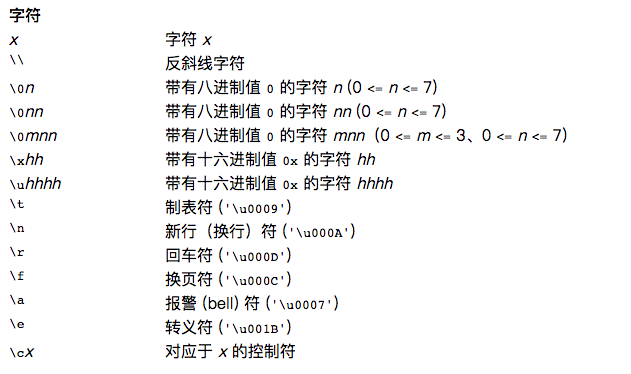
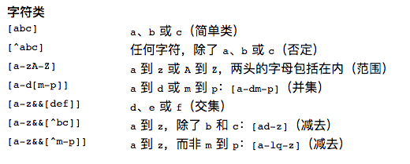
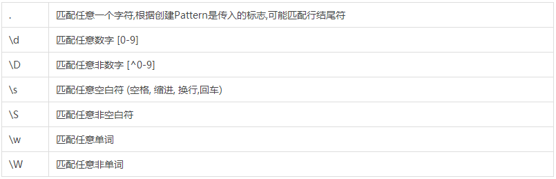
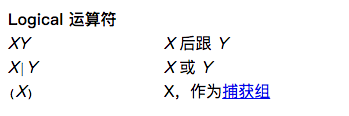
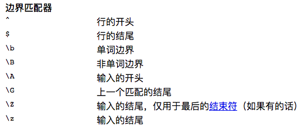
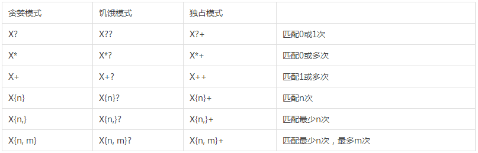

# 正则表达式

- [参考](#参考)
- [Pattern](#pattern)
- [Matcher](#matcher)
    - [Matches/LookingAt/find](#matcheslookingatfind)
    - [Reset](#reset)
    - [find/start/end](#findstartend)
    - [replaceAll/replaceFirst](#replaceallreplacefirst)
    - [appendReplacement/appendTail](#appendreplacementappendtail)
    - [group](#group)
- [具体语法](#具体语法)

## 参考

- [Java 正则表达式(精华)](http://www.jianshu.com/p/984b5e31868e)
- [Java正则表达式详解](http://www.jianshu.com/p/169b19aaebb0)
- [正则表达式具体的语法](http://tool.oschina.net/apidocs/apidoc?api=jdk-zh)

## Pattern

- Pattern 类包含多个标志(int 类型),这些标志可以控制Pattern 匹配模式的方式。上面代码中的标志使模式匹配忽略大小写

```java
String text = "This is the text to be searched " + "for occurrences of the http:// pattern.";
String patternString = ".*http://.*";

Pattern pattern = Pattern.compile(patternString, Pattern.CASE_INSENSITIVE);
```

- 一旦获得了Pattern对象，接着可以获得Matcher对象。Matcher 示例用于匹配文本中的模式.

```java
Matcher matcher = pattern.matcher(text);
```

- Pattern.split(),Pattern 类的 split()方法，可以用正则表达式作为分隔符，把文本分割为String类型的数组

```java
String text = "A sep Text sep With sep Many sep Separators";
String patternString = "sep";
Pattern pattern = Pattern.compile(patternString);
String[] split = pattern.split(text);
System.out.println("split.length = " + split.length);
for(String element : split){
System.out.println("element = " + element);
}
```

- Pattern对象是不可变对象，可以在多线程中安全使用

## Matcher

### Matches/LookingAt/find

- matches:整个匹配，只有整个字符序列完全匹配成功，才返回True，否则返回False。**但如果前部分匹配成功，将移动下次匹配的位置。**
- lookingAt:部分匹配，**总是从第一个字符进行匹配**,匹配成功了不再继续匹配，匹配失败了,也不继续匹配。
- find:部分匹配，从当前位置开始匹配，**找到一个匹配的子串，将移动下次匹配的位置。**

### Reset

- reset() 方法会重置Matcher 内部的 匹配状态。当find() 方法开始匹配时,Matcher 内部会记录截至当前查找的距离。调用 reset() 会重新从文本开头查找。
   - 也可以调用 reset(CharSequence) 方法. 这个方法重置Matcher,同时把一个新的字符串作为参数传入，用于代替创建 Matcher 的原始字符串。

```java
public class RegexTest2 {
    public static void main(String[] args){
        test();
    }

    public static void test() {
        Pattern pattern = Pattern.compile("\\d{3,5}");
        String charSequence = "123-34345-234-00";
        Matcher matcher = pattern.matcher(charSequence);

        //虽然匹配失败，但由于charSequence里面的"123"和pattern是匹配的,所以下次的匹配从位置4开始
        print(matcher.matches());
        //测试匹配位置
        matcher.find();
        print(matcher.start());

        //使用reset方法重置匹配位置
        matcher.reset();

        //第一次find匹配以及匹配的目标和匹配的起始位置
        print(matcher.find());
        print(matcher.group()+" - "+matcher.start());
        //第二次find匹配以及匹配的目标和匹配的起始位置
        print(matcher.find());
        print(matcher.group()+" - "+matcher.start());

        //第一次lookingAt匹配以及匹配的目标和匹配的起始位置
        print(matcher.lookingAt());
        print(matcher.group()+" - "+matcher.start());

        //第二次lookingAt匹配以及匹配的目标和匹配的起始位置
        print(matcher.lookingAt());
        print(matcher.group()+" - "+matcher.start());
    }


    public static void print(Object o){
        System.out.println(o);
    }
}

// false 4 true 123 - 0 true 34345 - 4 true 123 - 0 true 123 - 0****
```

### find/start/end

- find() 方法用于在文本中查找出现的正则表达式，如果在文本中多次匹配，find() 方法返回第一个，之后每次调用 find() 都会返回下一个。
- start() 和 end() 返回每次匹配的字串在整个文本中的开始和结束位置。实际上, end() 返回的是字符串末尾的后一位，这样，可以在把 start() 和 end() 的返回值直接用在String.substring() 里。

```java
String text    =
        "This is the text which is to be searched " +
        "for occurrences of the word 'is'.";
String patternString = "is";
Pattern pattern = Pattern.compile(patternString);
Matcher matcher = pattern.matcher(text);
int count = 0;
while(matcher.find()) {
    count++;
    System.out.println("found: " + count + " : "  + matcher.start() + " - " + matcher.end());
}
```

### replaceAll/replaceFirst

- replaceAll() 和 replaceFirst() 方法可以用于替换Matcher搜索字符串中的一部分。
- replaceAll() 方法替换全部匹配的正则表达式，replaceFirst() 只替换第一个匹配的。

### appendReplacement/appendTail

```java
public Matcher appendReplacement(StringBuffer sb, String replacement)
public StringBuffer appendTail(StringBuffer sb)
```

- appendReplacement() 和 appendTail() 方法用于替换输入文本中的字符串短语，同时把替换后的字符串附加到一个 StringBuffer 中。
- 当find() 方法找到一个匹配项时，可以调用 appendReplacement() 方法，这会导致输入字符串被增加到StringBuffer 中，而且匹配文本被替换。 从上一个匹配文本结尾处开始，直到本次匹配文本会被拷贝。
- appendReplacement() 会记录拷贝StringBuffer 中的内容，可以持续调用find(),直到没有匹配项。
- 直到最后一个匹配项目，输入文本中剩余一部分没有拷贝到 StringBuffer. 这部分文本是从最后一个匹配项结尾，到文本末尾部分。**通过调用 appendTail() 方法，可以把这部分内容拷贝到 StringBuffer 中**

```java
String text = "John writes about this, and John Doe writes about that, and John Wayne writes about everything.";

String patternString1 = "((John) (.+?)) ";
Pattern pattern = Pattern.compile(patternString1);
Matcher matcher = pattern.matcher(text);
StringBuffer stringBuffer = new StringBuffer();

while(matcher.find()){
    matcher.appendReplacement(stringBuffer, "Joe Blocks ");
    System.out.println(stringBuffer.toString());
}
matcher.appendTail(stringBuffer);
System.out.println(stringBuffer.toString());

```

### group

- 分组在正则表达式中用括号表示,**括号不属于要匹配的文本。**
- 当正则表达式匹配到文本后，可以访问分组内的部分。一个正则表达式可以有多个分组。**每个分组由一对括号标记**。想要访问正则表达式中某分组匹配的文本，可以把分组编号传入 group(int groupNo)方法。
- **group(0)永远表示整个正则表达式**

```java
String patternStr = "((A)(B(C)))"
// 一共有4个分组
// 1        ((A)(B(C)))
// 2        (A)
// 3        (B(C))
// 4        (C)
```

## 具体语法











