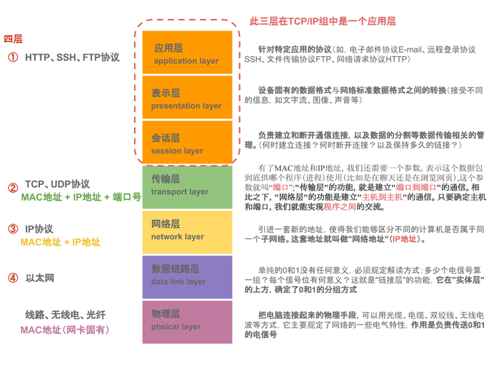
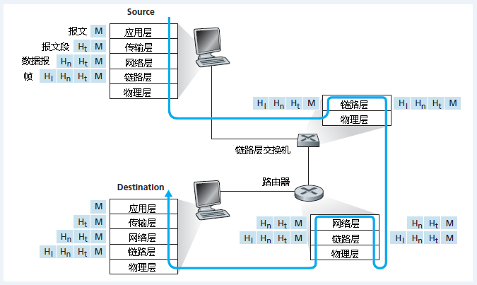
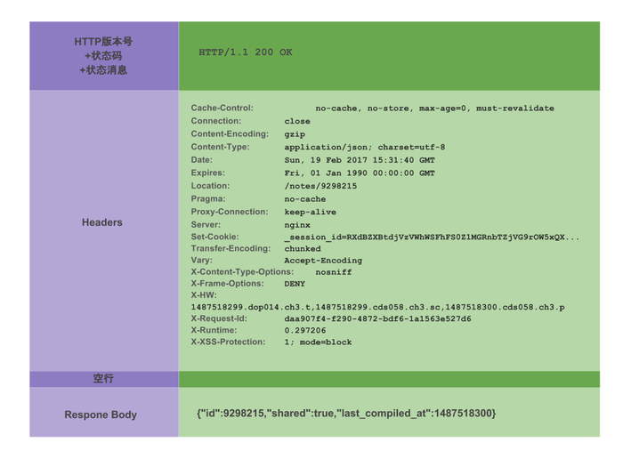

# 网络

## 参考资料

-   [计算机网络协议层次](https://blog.csdn.net/gavin_john/article/details/53186570)
-   [HTTP 协议详解与 Android 相关基础网络编程](https://www.jianshu.com/p/3ea1bf1ba915)
-   [HTTP 请求行、请求头、请求体详解](https://blog.csdn.net/u010256388/article/details/68491509)

## 网络层次划分

-   

### 应用层

-   **定义数据格式并按照对应的格式解读数据**
-   应用层是网络应用程序以及它们的应用层协议存留的地方。因特网应用层包括许多协议，例如 HTTP（Web 应用的主要协议）、SMTP（邮件传输）和 FTP（文件传送）等。再比如我们每天都在使用的 DNS 域名系统。
-   应用层协议分布在多个端系统上，一个端系统中的应用程序使用协议与另外一个端系统中的应用程序交换信息的分组。
-   我们把位于应用层的信息分组称为报文。

### 传输层

-   主要工作是定义端口，标识应用程序身份，实现端口到端口的通信
-   因特网的传输层在应用程序端点之间传送应用层报文。**在因特网中，有 TCP 和 UDP 两个传输层协议。**
-   **TCP 向它的应用程序提供了面向连接的服务**，这种服务包括了应用层报文向目的地的确保传递和流量控制。TCP 也将长报文划分成短报文，并提供拥塞控制机制，因此，当网络拥塞时，发送方可以抑制其传输速率。
-   **UDP 协议向它的应用程序提供无连接服务**。这是一种不提供不必要服务的服务，没有可靠性，没有流量控制，也没有拥塞控制。
-   我们把传输层分组称为报文段。

### 网络层

-   网络层的主要工作是定义网络地址、区分网段、子网内 MAC 寻址、对于不同子网的数据包进行路由
-   因特网的网络层负责将称为数据报的网络层分组从一台主机移动到另一台主机。**在一台源主机中的因特网传输层协议(TCP 或者 UDP)向网络层递交传输层报文段和目的地址。**
-   **网络层包括著名的 IP 协议**，该协议定义了在数据报中的各个字段以及端系统和路由器如果作用于这些字段。
-   **网络层也包括决定路由的路由选择协议，它使得数据报根据该路由从源传输到目的地。**

### 链路层

-   对电信号进行分组并形成具有特定意义的数据帧，确认主机的物理地址，传输数据
-   网络层通过源和目的地之间的一系列路由器路由数据报，为了将分组从一个结点移动到路径的下一个结点，网络层必须依靠链路层的服务。特别是在每个结点，网络层将数据报下传给链路层，链路层沿着路径将数据报传递给下一个结点，在下一个结点，链路层将数据报上传给网络层。
-   由链路层提供的服务取决于应用于该链路的特定的链路层协议，**比如我们常见的以太网，WIFI 等。**
-   因为数据报从源到目的地传送通常要经过几条链路，一个数据报可能被沿途不同链路上的不同链路层协议处理。例如，一个数据报可能被一段链路上的以太网和下一段链路上的 PPP 所处理。网络层将受到来自每个不同链路的链路层协议的服务。
-   我们把链路层分组称为帧。

### 物理层

-   **链路层的任务是将整个帧从一个网络元素移动到邻近的网络元素，而物理层的任务是将该帧中的一个一个比特从一个结点移动到下一个结点**。
-   物理层的协议是和链路相关的，并且进一步与该链路的实际传输媒体相关。比如，以太网具有许多物理层协议：一个是关于双绞铜线的，另一个是关于同轴电缆的，还有是关于光纤的等等。

## 报文的封装

-   

## Socket

-   **Socket 对 TCP/IP 协议的封装是跨传输层和应用层的**
-   **Socket 是对 TCP/IP 协议的封装，他本身不是什么协议，而是一个调用接口（API）**
-   TCP/IP 只是一个协议栈，必须要具体实现，同时还要提供对外的操作接口，这就是 Socket 接口

## 3 次握手与 4 次挥手

-   [TCP/IP--理解 TCP 三次握手和四次挥手](https://www.jianshu.com/p/4084a9397138)

## URL

-   schema://host[:port#]/path/.../[;url-params][?query-string][#anchor]

## Http 请求报文格式

-   
-   

## Http Header

-   [List of HTTP header fields](https://en.wikipedia.org/wiki/List_of_HTTP_header_fields)

### Accept

-   请求报文可通过一个“Accept”报文头属性告诉服务端 客户端接受什么类型的响应

```java
Accept:text/plain
```

-   [mineType](https://en.wikipedia.org/wiki/Media_type)

### Referer

-   Referer 是 header 的一部分，**当浏览器向 web 服务器发送请求的时候，一般会带上 Referer，告诉服务器我是从哪个页面链接过来的，服务器藉此可以获得一些信息用于处理**。比如从我主页上链接到一个朋友那里，他的服务器就能够从 HTTP Referer 中统计出每天有多少用户点击我主页上的链接访问他的网站

### Cache-Control

-   Cache-Control 指定请求和响应遵循的缓存机制。
-   缓存指令是单向的，即请求中存在一个指令并不意味着响应中将存在同一个指令
-   请求时的缓存指令包括 no-cache、no-store、max-age、max-stale、min-fresh、only-if-cached。
-   响应消息中的指令包括 public、private、no-cache、no-store、no-transform、must-revalidate、proxy-revalidate、max-age。

| Cache-directive                      | 说明                                                                                                                                                                                                   |
| ------------------------------------ | ------------------------------------------------------------------------------------------------------------------------------------------------------------------------------------------------------ |
| public                               | 所有内容都将被缓存(客户端和代理服务器都可缓存)                                                                                                                                                         |
| private                              | 内容只缓存到私有缓存中(仅客户端可以缓存，代理服务器不可缓存)                                                                                                                                           |
| no-cache                             | 必须先与服务器确认返回的响应是否被更改，然后才能使用该响应来满足后续对同一个网址的请求。因此，如果存在合适的验证令牌 (ETag)，no-cache 会发起往返通信来验证缓存的响应，如果资源未被更改，可以避免下载。 |
| no-store                             | 所有内容都不会被缓存到缓存或 Internet 临时文件中                                                                                                                                                       |
| must-revalidation/proxy-revalidation | 如果缓存的内容失效，请求必须发送到服务器/代理以进行重新验证                                                                                                                                            |
| max-age=xxx (xxx is numeric)         | 缓存的内容将在 xxx 秒后失效, 这个选项只在 HTTP 1.1 可用, 并如果和 Last-Modified 一起使用时, 优先级较高                                                                                                 |

## Http 响应报文格式

-   

### 状态码

| 状态码 | 说明                                      |
| ------ | ----------------------------------------- |
| 1XX    | 提示信息 - 表示请求已被成功接收，继续处理 |
| 2XX    | 成功 - 表示请求已被成功接收，理解，接受   |
| 3XX    | 重定向 - 要完成请求必须进行更进一步的处理 |
| 4XX    | 客户端错误 - 请求有语法错误或请求无法实现 |
| 5XX    | 服务器端错误 - 服务器未能实现合法的请求   |

-   **200 OK**，你最希望看到的，即处理成功！
-   **303 See Other**，我把你 redirect 到其它的页面，目标的 URL 通过响应报文头的 Location 告诉你。
-   **304 Not Modified**， 告诉客户端，你请求的这个资源至你上次取得后，并没有更改，你直接用你本地的缓存吧
-   **404 Not Found**， 你最不希望看到的，即找不到页面。如你在 google 上找到一个页面，点击这个链接返回 404，表示这个页面已经被网站删除了，google 那边的记录只是美好的回忆
-   **500 Internal Server Error**，看到这个错误，你就应该查查服务端的日志了，肯定抛出了一堆异常

## Https

-   证书验证身份
-   非对称加密确定加密方式与加密密钥，对称加密加密内容
-   数字摘要,保护数据完整性
-   对称加密（DES），非对称加密(RSA)

### 算法简述

-   client 向 server 发送请求https://baidu.com，然后连接到server的443端口。
-   服务端必须要有一套数字证书，可以自己制作，也可以向组织申请。区别就是自己颁发的证书需要客户端验证通过，才可以继续访问，而使用受信任的公司申请的证书则不会弹出提示页面，这套证书其实就是一对公钥和私钥。
-   传送证书，这个证书其实就是公钥，只是包含了很多信息，如证书的颁发机构，过期时间、服务端的公钥，第三方证书认证机构(CA)的签名，服务端的域名信息等内容。
-   客户端解析证书，这部分工作是由客户端的 TLS 来完成的，首先会验证公钥是否有效，比如颁发机构，过期时间等等，如果发现异常，则会弹出一个警告框，提示证书存在问题。如果证书没有问题，那么就生成一个随机值（秘钥）。然后用证书对该随机值进行加密。
-   传送加密信息，这部分传送的是用证书加密后的秘钥，目的就是让服务端得到这个秘钥，以后客户端和服务端的通信就可以通过这个随机值来进行加密解密了。
-   服务端加密信息，服务端用私钥解密秘密秘钥，得到了客户端传过来的私钥，然后把内容通过该值进行对称加密。
-   传输加密后的信息，这部分信息是服务端用私钥加密后的信息，可以在客户端被还原。
-   客户端解密信息，客户端用之前生成的私钥解密服务端传过来的信息，于是获取了解密后的内容。

## Http 1.0 / Http 1.1 / Http 2.0 / Http 3.0

-   [如何优雅的谈论 HTTP／1.0／1.1／2.0](https://www.jianshu.com/p/52d86558ca57)
-   [HTTP 发展的根本原因----连接无法复用和 head of line blocking](https://blog.csdn.net/qq_31813549/article/details/102924683)
-   [http1.0 http1.1 http2.0 http3.0 http https](https://blog.csdn.net/qq_26657145/article/details/105191217)

### Http 1.0

-   HTTP 1.0 规定浏览器与服务器只保持短暂的连接，浏览器的每次请求都需要与服务器建立一个 TCP 连接，服务器完成请求处理后立即断开 TCP 连接，服务器不跟踪每个客户也不记录过去的请求
-   http1.0 被抱怨最多的就是连接无法复用，和 head of line blocking 这两个问题
-   连接无法复用会导致每次请求都经历三次握手和慢启动。三次握手在高延迟的场景下影响较明显，慢启动则对文件类大请求影响较大
-   head of line blocking，会导致带宽无法被充分利用，以及后续健康请求被阻塞。假设有 5 个请求同时发出,对于 HTTP1.0 的实现, 在第一个请求没有收到回复之前，后续从应用层发出的请求只能排队，请求 2，3，4，5 只能等请求 1 的 response 回来之后才能逐个发出。网络通畅的时候性能影响不大，一旦请求 1 的 request 因为什么原因没有抵达服务器，或者 response 因为网络阻塞没有及时返回，影响的就是所有后续请求，问题就变得比较严重了

### Http 1.1

-   HTTP 1.1 支持持久连接（HTTP/1.1 的默认模式使用带流水线的持久连接），在一个 TCP 连接上可以传送多个 HTTP 请求和响应，减少了建立和关闭连接的消耗和延迟
-   HTTP 1.1 还允许客户端不用等待上一次请求结果返回，就可以发出下一次请求，但服务器端必须按照接收到客户端请求的先后顺序依次回送响应结果，以保证客户端能够区分出每次请求的响应内容，这样也显著地减少了整个下载过程所需要的时间
-   增加了很多的 header
    -   在 HTTP 1.1 中增加 Host 请求头字段后，WEB 浏览器可以使用主机头名来明确表示要访问服务器上的哪个 WEB 站点，这才实现了在一台 WEB 服务器上可以在同一个 IP 地址和端口号上使用不同的主机名来创建多个虚拟 WEB 站点
    -   Connection 请求头的值为 Keep-Alive 时，客户端通知服务器返回本次请求结果后保持连接；Connection 请求头的值为 close 时，客户端通知服务器返回本次请求结果后关闭连接
    -   HTTP 1.1 还提供了与身份认证、状态管理和 Cache 缓存等机制相关的请求头和响应头
    -   HTTP/1.0 不支持文件断点续传， RANGE:bytes 是 HTTP/1.1 新增内容

### Http 2.0

-   [HTTP2 详解](https://www.jianshu.com/p/e57ca4fec26f)

#### 多路复用

-   在 HTTP/2 中,新的二进制帧层,解除了这个限制.使得所有的请求和响应多路复用.通过允许客户端和服务端把 HTTP 消息分解成独立的帧,交错传输,然后在另一端组装.
-   在一个 TCP 连接上，我们可以向对方不断发送帧，每帧的 stream identifier 的标明这一帧属于哪个流，然后在对方接收时，根据 stream identifier 拼接每个流的所有帧组成一整块数据。
-   流的概念实现了单连接上多请求 - 响应并行，解决了线头阻塞的问题，减少了 TCP 连接数量和 TCP 连接慢启动造成的问题
-   每个源只需要一个连接，批量的数据传输.通过利用相同的 HTTP/2 连接,既能够充分利用 TCP 连接,也能减小整体协议的头部.更进一步来说,更少的连接内存的占用以及全连接路径的处理过程.向 HTTP/2 的转移不仅减少了网络潜在因素,更减少了操作代价
-   应用层的重置连接，对于 HTTP/1 来说，是通过设置 tcp segment 里的 reset flag 来通知对端关闭连接的。这种方式会直接断开连接，下次再发请求就必须重新建立连接。HTTP/2 引入 RST_STREAM 类型的 frame，可以在不断开连接的前提下取消某个 request 的 stream，表现更好。
-   优势
    -   减小了建立 tcp 连接的内存占用
    -   多路复用
    -   线头阻塞
    -   浏览器同一 host 的 tcp 限制
    -   tcp 连接的慢启动
    -   重置连接的代价

#### 首部压缩（Header Compression）

-   [https://blog.csdn.net/mrpre/article/details/80711439](https://blog.csdn.net/mrpre/article/details/80711439)

-   HTTP/1.1 并不支持 HTTP 首部压缩，为此 SPDY 和 HTTP/2 应运而生， SPDY 使用的是通用的 DEFLATE 算法，而 HTTP/2 则使用了专门为首部压缩而设计的 HPACK 算法
-   静态表： method:GET,使用约定的 index 表示
-   动态表： 双方维护动态表，再使用 index 表示
-   霍夫曼编码

#### 服务端推送（Server Push）

-   一个典型的 Web 应用程序由几十个资源组成，所有这些资源都是客户端通过检查服务器提供的文档发现的。因此，为什么不消除额外的延迟并让服务器提前推送相关资源？服务器已经知道客户端需要哪些资源;这是服务器推动
    -   推送的资源可以由客户端缓存
    -   推送的资源可以在不同的页面上重复使用
    -   推送的资源可以与其他资源一起复用
    -   推送的资源可以由服务器优先
    -   推送的资源可以被客户拒绝
    -   由浏览器执行的唯一安全限制是推送资源必须遵守同源策略：服务器必须对提供的内容具有权限。

#### 优先级

-   HTTP/2 里的每个 stream 都可以设置依赖 (Dependency) 和权重，可以按依赖树分配优先级，解决了关键请求被阻塞的问题

### Http 3.0

-   [QUIC 协议浅析与 HTTP/3.0](https://www.jianshu.com/p/bb3eeb36b479)

-   HTTP-over-QUIC 改名为 HTTP/3,QUIC（Quick UDP Internet Connections)基于 UDP 的传输层协议，提供像 TCP 一样的可靠性

#### 避免前序包阻塞

-   多个数据在 TCP 连接上传输时，若一个数据包出现问题，TCP 需要等待该包重传后，才能继续传输其它数据包。但在 QUIC 中，因为其基于 UDP 协议，UDP 数据包在出问题需要重传时，并不会对其他数据包传输产生影响。

#### 零 RTT 建立连接

-   目前 TCP 与 SSL/TLS(1.0,1.1,1.2)每次建连需要 TCP 三次握手+安全握手，需要 4~5 个 RRT

#### 优雅的丢包处理

-   QUIC 协议的每个数据包除了本身的数据以外，会带有其他数据包的部分数据，在少量丢包的情况下，可以使用其他数据包的冗余数据完成数据组装而无需重传，从而提高数据的传输速度。具体实现类似于 RAID5，将 N 个包的校验和（异或）建立一个单独的数据包发送，这样如果在这 N 个包中丢了一个包可以直接恢复出来。除此之外还可以用来校验包的正确性

#### 快速重启会话（支持手机网络切换）

-   普通基于 tcp 的连接，是基于两端的 ip 和端口和协议来建立的。在网络切换场景，例如手机端切换了无线网，使用 4G 网络，会改变本身的 ip，这就导致 tcp 连接必须重新创建。而 QUIC 协议使用特有的 UUID 来标记每一次连接，在网络环境发生变化的时候，只要 UUID 不变，就能不需要握手，继续传输数据
