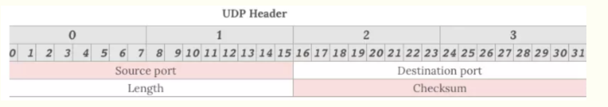
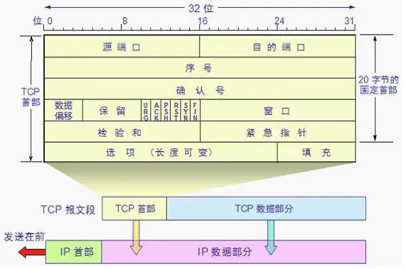
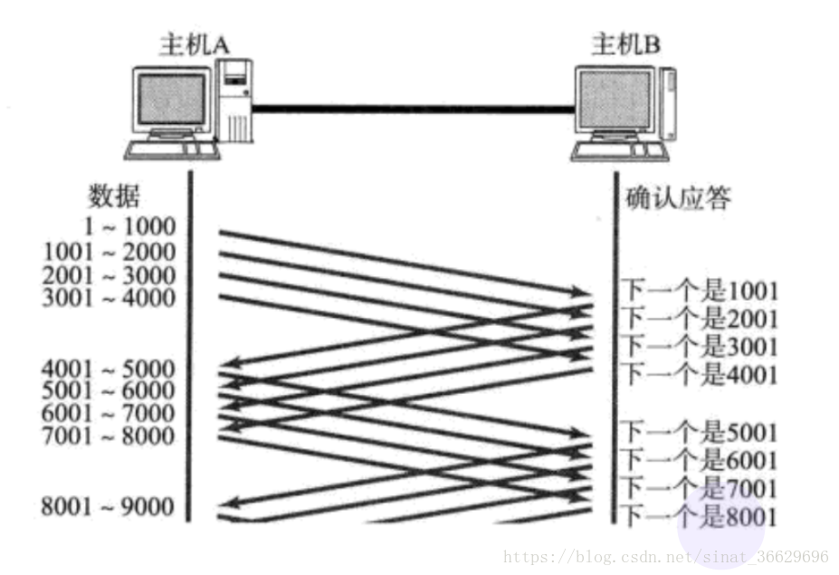
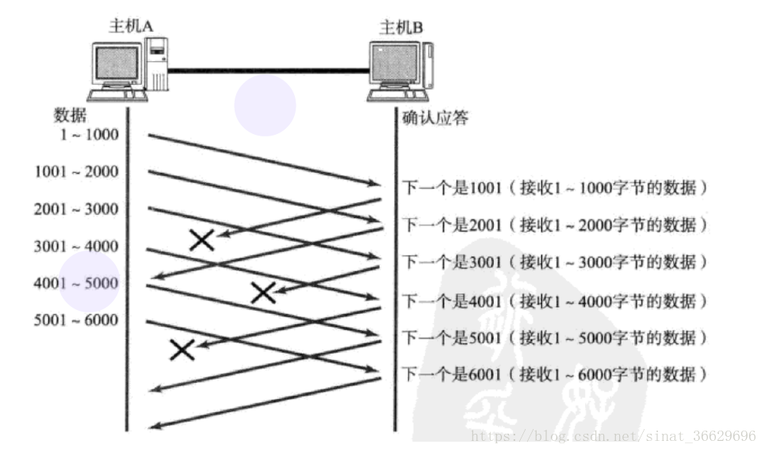
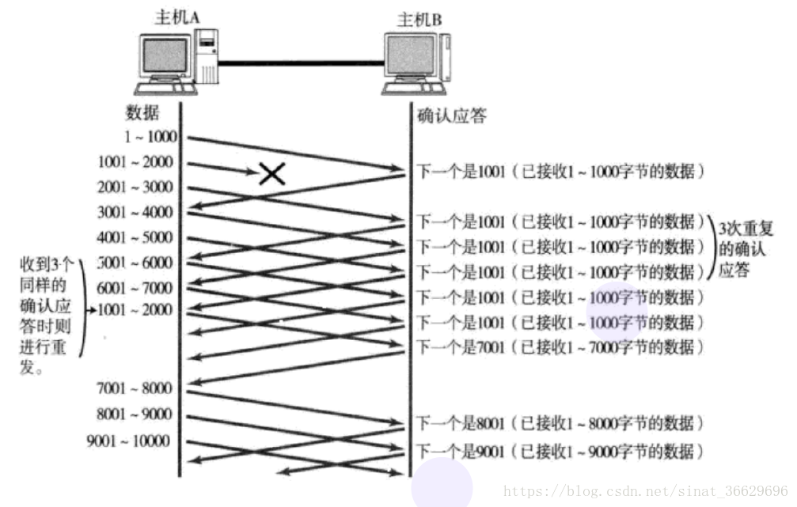
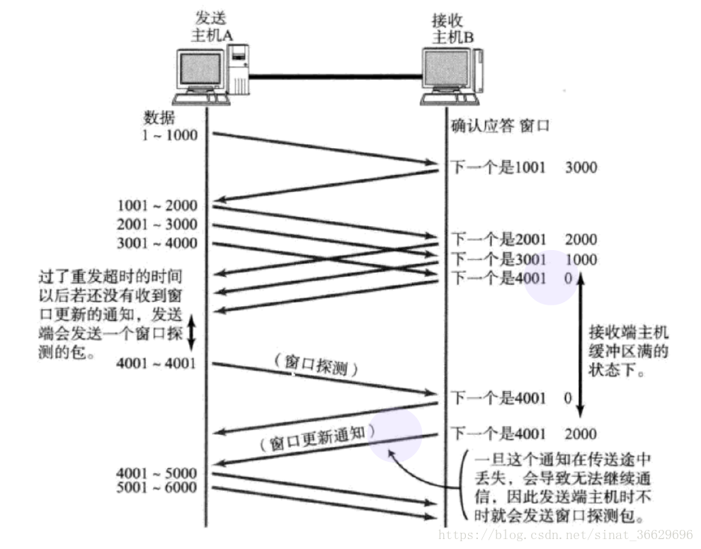
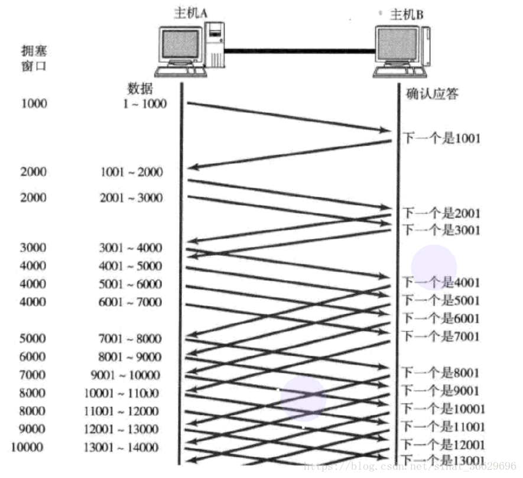

# TCP UDP

## 相关文章

-   [TCP 详解](https://blog.csdn.net/sinat_36629696/article/details/80740678)
-   [一文搞懂 TCP 与 UDP 的区别](https://www.cnblogs.com/fundebug/p/differences-of-tcp-and-udp.html)

## UDP

### 面向无连接

-   首先 UDP 是不需要和 TCP 一样在发送数据前进行三次握手建立连接的，想发数据就可以开始发送了。并且也只是数据报文的搬运工，不会对数据报文进行任何拆分和拼接操作。具体来说就是：
    -   在发送端，应用层将数据传递给传输层的 UDP 协议，UDP 只会给数据增加一个 UDP 头标识下是 UDP 协议，然后就传递给网络层了
    -   在接收端，网络层将数据传递给传输层，UDP 只去除 IP 报文头就传递给应用层，不会任何拼接操作

### 有单播，多播，广播的功能

-   UDP 不止支持一对一的传输方式，同样支持一对多，多对多，多对一的方式，也就是说 UDP 提供了单播，多播，广播的功能。

### UDP 是面向报文的

-   发送方的 UDP 对应用程序交下来的报文，在添加首部后就向下交付 IP 层。UDP 对应用层交下来的报文，既不合并，也不拆分，而是保留这些报文的边界。因此，应用程序必须选择合适大小的报文

### 不可靠性

-   首先不可靠性体现在无连接上，通信都不需要建立连接，想发就发，这样的情况肯定不可靠。
-   并且收到什么数据就传递什么数据，并且也不会备份数据，发送数据也不会关心对方是否已经正确接收到数据了。
-   **再者网络环境时好时坏，但是 UDP 因为没有拥塞控制，一直会以恒定的速度发送数据**。即使网络条件不好，也不会对发送速率进行调整。这样实现的弊端就是在网络条件不好的情况下可能会导致丢包，但是优点也很明显，在某些实时性要求高的场景（比如电话会议）就需要使用 UDP 而不是 TCP

### UDP header

-   

-   UDP 头部包含了以下几个数据：
    -   两个十六位的端口号，分别为源端口（可选字段）和目标端口
    -   整个数据报文的长度
    -   整个数据报文的检验和（IPv4 可选 字段），该字段用于发现头部信息和数据中的错误
    -   因此 UDP 的头部开销小，只有八字节，相比 TCP 的至少二十字节要少得多，在传输数据报文时是很高效的

## TCP

-   

### 三次握手，四次挥手

### TCP 校验和

-   TCP 校验和是一个端到端的校验和，由发送端计算，然后由接收端验证。其目的是为了发现 TCP 首部和数据在发送端到接收端之间发生的任何改动。如果接收方检测到校验和有差错，则 TCP 段会被直接丢弃。
-   TCP 校验和覆盖 TCP 首部和 TCP 数据，而 IP 首部中的校验和只覆盖 IP 的首部，不覆盖 IP 数据报中的任何数据。
-   TCP 的校验和是必需的，而 UDP 的校验和是可选的。
-   TCP 和 UDP 计算校验和时，都要加上一个 12 字节的伪首部

### ACK 机制

### 超时重传机制

-   主机 A 发送数据给 B 之后, 可能因为网络拥堵等原因, 数据无法到达主机 B,如果主机 A 在一个特定时间间隔内没有收到 B 发来的确认应答, 就会进行重发,但是主机 A 没收到确认应答也可能是 ACK 丢失了

#### 超时时间如何确定

-   最理想的情况下, 找到一个最小的时间, 保证 “确认应答一定能在这个时间内返回”.但是这个时间的长短, 随着网络环境的不同, 是有差异的.如果超时时间设的太长, 会影响整体的重传效率; 如果超时时间设的太短, 有可能会频繁发送重复的包.
-   TCP 为了保证任何环境下都能保持较高性能的通信, 因此会动态计算这个最大超时时间.
    -   Linux 中(BSD Unix 和 Windows 也是如此), 超时以 500ms 为一个单位进行控制, 每次判定超时重发的超时时间都是 500ms 的整数倍.
    -   如果重发一次之后, 仍然得不到应答, 等待 2\*500ms 后再进行重传. 如果仍然得不到应答, 等待 4\*500ms 进行重传.

### 滑动窗口

#### 窗口

-   窗口大小指的是无需等待确认应答就可以继续发送数据的最大值
-   操作系统内核为了维护这个滑动窗口, 需要开辟发送缓冲区来记录当前还有哪些数据没有应答，只有 ACK 确认应答过的数据, 才能从缓冲区删掉.
-   下图的窗口大小就是 4000 个字节 (四个段)，发送前四个段的时候, 不需要等待任何 ACK, 直接发送，收到第一个 ACK 确认应答后, 窗口向后移动, 继续发送第五六七八段的数据，因为这个窗口不断向后滑动, 所以叫做滑动窗口

#### 丢包处理

-   数据包已经收到, 但确认应答 ACK 丢了，这种情况下, **部分 ACK 丢失并无大碍, 因为还可以通过后续的 ACK 来确认对方已经收到了哪些数据包**

#### 滑动窗口快速重传

-   **当某一段报文丢失之后, 发送端会一直收到 1001 这样的 ACK, 就像是在提醒发送端 “我想要的是 1001”，如果发送端主机连续三次收到了同样一个 “1001” 这样的应答, 就会将对应的数据 1001 - 2000 重新发送**，这个时候接收端收到了 1001 之后, 再次返回的 ACK 就是 7001 了因为 2001 - 7000 接收端其实之前就已经收到了, 被放到了接收端操作系统内核的接收缓冲区中.

### 流量控制

-   接收端处理数据的速度是有限的. 如果发送端发的太快, 导致接收端的缓冲区被填满, 这个时候如果发送端继续发送, 就会造成丢包, 进而引起丢包重传等一系列连锁反应.**因此 TCP 支持根据接收端的处理能力, 来决定发送端的发送速度.这个机制就叫做 流量控制(Flow Control)**
-   **接收端将自己可以接收的缓冲区大小放入 TCP 首部中的 “窗口大小” 字段,通过 ACK 通知发送端**;窗口大小越大, 说明网络的吞吐量越高;接收端一旦发现自己的缓冲区快满了, 就会将窗口大小设置成一个更小的值通知给发送端;发送端接受到这个窗口大小的通知之后, 就会减慢自己的发送速度;
-   **如果接收端缓冲区满了, 就会将窗口置为 0;这时发送方不再发送数据, 但是需要定期发送一个窗口探测数据段, 让接收端把窗口大小再告诉发送端.**

### 拥塞控制

-   虽然 TCP 有了滑动窗口这个大杀器, 能够高效可靠地发送大量数据.但是如果在刚开始就发送大量的数据, 仍然可能引发一些问题.因为网络上有很多计算机, 可能当前的网络状态已经比较拥堵.在不清楚当前网络状态的情况下, 贸然发送大量数据, 很有可能雪上加霜.
-   因此, TCP 引入**慢启动机制, 先发少量的数据, 探探路, 摸清当前的网络拥堵状态以后, 再决定按照多大的速度传输数据.**

#### 拥塞窗口

-   发送开始的时候, 定义拥塞窗口大小为 1;
-   每次收到一个 ACK 应答, 拥塞窗口加 1;
-   每次发送数据包的时候, 将拥塞窗口和接收端主机反馈的窗口大小做比较, 取较小的值作为实际发送的窗口
-   像上面这样的拥塞窗口增长速度, 是指数级别的.“慢启动” 只是指初使时慢, 但是增长速度非常快.为了不增长得那么快, 此处引入一个名词叫做慢启动的阈值, 当拥塞窗口的大小超过这个阈值的时候, 不再按照指数方式增长, 而是按照线性方式增长
-   少量的丢包, 我们仅仅是触发超时重传;大量的丢包, 我们就认为是网络拥塞;当 TCP 通信开始后, 网络吞吐量会逐渐上升;随着网络发生拥堵, 吞吐量会立刻下降.

#### 拥塞避免

-   为了防止拥塞窗口 cwnd 增长过大引起网络拥塞，还需要设置一个慢开始门限 ssthresh 状态变量（如何设置 ssthresh）。慢开始门限 ssthresh 的用法如下：
    -   当 cwnd < ssthresh 时，使用上述的慢开始算法。
    -   当 cwnd > ssthresh 时，停止使用慢开始算法而改用拥塞避免算法。
    -   当 cwnd = ssthresh 时，既可使用慢开始算法，也可使用拥塞控制避免算法。

#### 快重传与快恢复

-   快重传要求接收方在收到一个失序的报文段后就立即发出重复确认（为的是使发送方及早知道有报文段没有到达对方）而不要等到自己发送数据时捎带确认。
-   快重传算法规定，发送方只要一连收到三个重复确认就应当立即重传对方尚未收到的报文段，而不必继续等待设置的重传计时器时间到期
-   快重传配合使用的还有快恢复算法，**当发送方连续收到三个重复确认时，就执行“乘法减小”算法，把 ssthresh 门限减半**。但是接下去并不执行慢开始算法。考虑到如果网络出现拥塞的话就不会收到好几个重复的确认，所以发送方现在认为网络可能没有出现拥塞。**所以此时不执行慢开始算法，而是将 cwnd 设置为 ssthresh 的大小，然后执行拥塞避免算法**

#### 拥塞控制实际效果

-   当 TCP 开始启动的时候, 慢启动阈值等于窗口最大值
-   **在每次超时重发的时候, 慢启动阈值会变成原来的一半, 同时拥塞窗口置回 1**
-   少量的丢包, 我们仅仅是触发超时重传;
-   大量的丢包, 我们就认为是网络拥塞;
-   当 TCP 通信开始后, 网络吞吐量会逐渐上升;
-   随着网络发生拥堵, 吞吐量会立刻下降.
-   拥塞控制, 归根结底是 TCP 协议想尽可能快的把数据传输给对方, 但是又要避免给网络造成太大压力的折中方案

### 延迟应答

-   **如果接收数据的主机立刻返回 ACK 应答, 这时候返回的窗口可能比较小**.假设接收端缓冲区为 1M. 一次收到了 500K 的数据;如果立刻应答, 返回的窗口大小就是 500K;但实际上可能处理端处理的速度很快, 10ms 之内就把 500K 数据从缓冲区消费掉了; 在这种情况下, 接收端处理还远没有达到自己的极限, 即使窗口再放大一些, 也能处理过来;**如果接收端稍微等一会儿再应答, 比如等待 200ms 再应答, 那么这个时候返回的窗口大小就是 1M**
-   窗口越大, 网络吞吐量就越大, 传输效率就越高.
-   数量限制: 每隔 N 个包就应答一次
-   时间限制: 超过最大延迟时间就应答一次
-   具体的数量 N 和最大延迟时间, 依操作系统不同也有差异，一般 N 取 2, 最大延迟时间取 200ms

### 捎带应答

-   在延迟应答的基础上, 我们发现, 很多情况下，客户端和服务器在应用层也是 “一发一收” 的，意味着客户端给服务器说了 “How are you”，服务器也会给客户端回一个 “Fine, thank you”， **那么这个时候 ACK 就可以搭顺风车, 和服务器回应的 “Fine, thank you” 一起发送给客户端**

### 面向字节流

-   创建一个 TCP 的 socket, 同时在内核中创建一个 发送缓冲区 和一个 接收缓冲区;
-   调用 write 时, 数据会先写入发送缓冲区中;如果发送的字节数太大, 会被拆分成多个 TCP 的数据包发出;如果发送的字节数太小, 就会先在缓冲区里等待, 等到缓冲区大小差不多了, 或者到了其他合适的时机再发送出去;
-   接收数据的时候, 数据也是从网卡驱动程序到达内核的接收缓冲区;然后应用程序可以调用 read 从接收缓冲区拿数据;
-   TCP 的一个连接, 既有发送缓冲区, 也有接收缓冲区,那么对于这一个连接, 既可以读数据, 也可以写数据, 这个概念叫做 全双工

### 总结

#### 保证可靠性的机制

-   校验和
-   序列号(按序到达)
-   确认应答(ACK)
-   超时重传
-   连接管理(三次握手，四次挥手)
-   流量控制(缓冲区大小放入 TCP 首部中的 “窗口大小” 字段)
-   拥塞控制

#### 提高性能的机制

-   滑动窗口
-   快速重传
-   快速恢复
-   延迟应答
-   捎带应答

#### 定时器

-   超时重传定时器
-   保活定时器
-   TIME_WAIT 定时器
