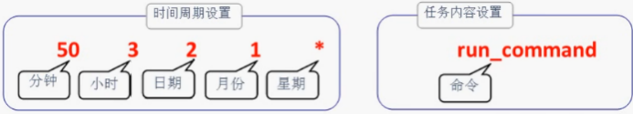

# shell脚本

- Shell脚本是将各种命令通过逻辑语句组合而成的程序

- 脚本每行写一条Linux命令。并且一个完整的Shell脚本则应该包括"脚本声明"、"注释信息"和"可执行语句"

  ```
  脚本声明(#!):告知系统用何种shell来解释。
  注释信息(#):对可执行语句或程序功能做介绍，可以不写。
  可执行语句:执行的具体命令。
  ```

- 执行脚本有三种方法

  ```
  脚本文件路径:./Example.sh
  sh脚本文件路径:sh Example.sh
  source脚本文件路径:source Example.sh
  ```

- 采用直接执行的方式有时可能权限不够，需要给脚本可执行权限，或者用sh,source执行脚本

  ```
  ./Example.sh
  发现权现不够
  chmod u+x Example.sh
  ./Example.sh
  ```

- shell可以接受用户输入

  ```
  ./Example.sh one two three four five six
  $0    当前执行Shell脚本的程序名。
  $1-9,${10},${11}……    参数的位置变量。
  $#    一共有多少个参数。
  $*    所有位置变量的值。
  $?    判断上一条命令是否执行成功，0为成功，非0为失败。
  ```

# 测试语句

- 测试语句能够测试特定的表达式是否成立，当条件成立时返回值为0，否则返回其他数值

- 测试语句格式：[ 测试语句 ]，其中 **中括号两边均有一个空格**

- 测试语句可以分为:文件测试，逻辑测试，整数值比较，字符串比较

## 文件测试

- 操作符

  ```
  -d    测试是否为目录。
  -f    判断是否为文件。
  -e    测试文件或目录是否存在。
  -r    测试当前用户是否有权限读取。
  -w    测试当前用户是否有权限写入。
  -x    测试当前用户是否有权限执行。
  ```

- 示例

  ```bash
  [ -d /etc ]
  $?
  ```

## 逻辑测试

- [ 表达式1 ] 操作符 [ 表达式2 ]

- 操作符

  ```
  &&    逻辑的与，"而且"的意思。
  ||    逻辑的或，"或者"的意思。
  !    逻辑的否。
  ```

- 示例

  ```bash
    [ $USER != root ] && echo "user" || echo "root"
  ```

## 整数比较

- 整数值比较:[ 整数1 操作符 整数2 ]

- 运算符

  ```
  -eq    判断是否等于
  -ne    判断是否不等于
  -gt    判断是否大于
  -lt    判断是否小于
  -le    判断是否等于或小于
  -ge    判断是否大于或等于
  ```

- 示例

  ```
  [ 10 -gt 10 ]

  获取当前可用的内存量，并将此值赋值给变量FreeMem:
  FreeMem=`free -m | grep cache: | awk '{print $3}'`
  判断此值是否小与1024(单位是M)，若小于则提示内存不足:
  [ $FreeMem -lt 1024 ] && echo "Insufficient Memory"
  ```

## 字符串比较

- [字符串1 操作符 字符串2]

- 运算符

  ```
  =    比较字符串内容是否相同。
  !=    比较字符串内容是否不同。
  -z    判断字符串内容是否为空。
  ```

- 示例

  ```bash
  [ $LANG != "en.US" ] && echo "Not en.US"
  ```

# 条件测试语句

## if语句

- if条件语句

  ```bash
  if 条件测试语句
  then 命令
  fi
  ```

- 双分支结构

  ```bash
  if 条件测试语句
  then 命令
  else
  命令
  fi
  ```

- 多分支结构

  ```bash
  if 条件测试语句
  then 命令
  elif 条件测试语句
  then 命令
  else
  命令
  fi
  ```

- 示例1

  ```bash
  #!/bin/bash
  DIR="/media/cdrom"
  if [ !-e $DIR ]; then
    mkdir -p $DIR
  fi
  ```

- 示例2 为了减少用户的等待时间，需要为ping命令追加-c参数代表发送数据包的个数，-i代表每0.2秒发一个数据包，-W则为3秒即超时。而$1为用户输入的第一个参数（IP地址），$?为上一条命令的执行结果，判断是否等于0(即成功)

  ```bash
  ping -c 3 -i 0.2 -W 3 $1 &>/dev/null
  if[ $? -eq 0 ]; then
    ehco "Host $1 is up"
  else
    echo "Host $1 is down"
  fi
  ```

- 示例3 根据分数评等级

  ```bash
  #!/bin/bash
  read -p "Enter your socre(0~100)":GRADE
  if [ $GRADE -ge 85 ] && [ $GRADE -le 100 ] ; then
    echo "$GRADE is Excellent"
  elif [ $GRADE -ge 70 ] && [ $GRADE -le 84 ] ; then
    echo "$GRADE is Pass"
  else
    echo "$GRADE is Fail"
  fi
  ```

## for语句

- 基本命令

  ```bash
  for 变量名 in 取值列表
  do
    命令
  done
  ```

- 示例:Shell脚本提示用户输入要设置的密码并赋值给PASSWD变量，从users.txt文件中读入用户名并赋值给UNAME变量， 而查看用户的信息都重定向到/dev/null文件，不显示到屏幕

  ```bash
  #!/bin/bash
  read -p "Enter the user password:" PASSWD
  for UNAME in `cat users.txt`; do
    id $UNAME &> /dev/null
    if [ $? -eq 0 ]; then
      echo "Already exists"
    else
      useradd $UNAME &> /dev/null
      echo $PASSWD | passwd --stdin $UNAME &> /dev/null
      if [ $? -eq 0 ]; then
        echo "Create success"
      else
        echo "Create failture"
      fi
    fi
  done
  ```

- 示例：从列表文件中读取主机地址，逐个测试是否在线

  ```bash
  HLIST = $(cat ~/ipadds.txt)
  for IP in HLIST; do
    ping -c 3 -i 0.2 -W 3 $IP &> /dev/null
    if [ $? -eq 0 ]; then
      echo "Host $IP is up"
    else
      echo "Host $IP is down"
    fi
  done
  ```

## while语句

- 基本语法

  ```bash
  while 条件测试语句
  do
    命令
  done
  ```

- 示例：随机生成一个0-999的整数，判断并提示用户输入的值过高或过低

  ```bash
  #!/bin/bash

  PRICE = $(expr $RANDOM % 1000)
  TIMES = 0
  echo "商品实际价格为0-999之间，猜猜看是多少？"
  while true; do
    read -p "请输入你猜测的价格数目：" INT
    let TIMES++
    if [ $INT -eq $PRICE ]; then
      echo "恭喜你答对了，实际价格是 $PRICE"
      echo "你总共猜测了 $TIMES 次"
      exit 0
    elif [ $INT -gt $PRICE ]; then
      echo "太高了！"
    else
      echo "太低了！"
    fi
  done
  ```

## case语句

- 基本语法

  ```bash
  case 变量值 in
    模式1 )
      命令
      ;;
    模式2)
      命令
      ;;
  esac
  ```

- 示例

  ```bash
  #!/bin/bash
  read -p "请输入一个字符，并按Enter键确认：" KEY
  case $KEY in
    [a-z]|[A-Z] )
      echo "您输入的是 字母。"
      ;;
    [0-9]) )
      echo "您输入的是 字母。"
      ;;
  esac
  ```

# 计划任务服务

## 一次性任务

- 一次性任务吧，它是由atd服务/进程来实现的，计划的管理操作是"at"命令

  ```
  at <时间>    安排一次性任务
  atq或at -l    查看任务列表
  at -c 序号    预览任务与设置环境
  atrm 序号    删除任务
  ```

- 示例

  ```
  交互式：
  at 23:30
  at > systemctl start httpd
  at > job 3 at Mon Apr 27 23:30:00 2015

  非交互式：
  echo "systemctl start httpd" | at 23:30

  查看任务：
  atq
  ```

## 长期任务

- 基本命令

  ```
  创建、编辑计划任务:crontab -e [-u 用户名]
  查看计划任务:crontab -l [-u 用户名]
  删除计划任务:crontab -r [-u 用户名]
  ```

- 创建参数 

- 示例，每周1、3、5的凌晨3点25分将/home/wwwroot目录打包备份为backup.tar.gz"

  ```
  crontab -e
  25 3 * * 1,3,5 /usr/bin/tar -czvf backukp.tar.gz /home/wwwroot
  ```
