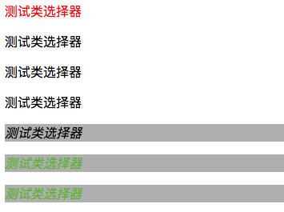

# CSS

- [参考资料](#参考资料)
- [CSS 格式](#css-格式)
- [CSS使用](#css使用)
    - [内联样式](#内联样式)
    - [内部样式表](#内部样式表)
    - [外部样式表](#外部样式表)
    - [优先级](#优先级)
- [选择器](#选择器)
    - [element 选择器](#element-选择器)
    - [分组选择器](#分组选择器)
    - [id 选择器](#id-选择器)
    - [class 选择器](#class-选择器)
        - [普通class选择器](#普通class选择器)
        - [特定元素的class选择器](#特定元素的class选择器)
        - [多类选择](#多类选择)
    - [属性选择器](#属性选择器)
        - [含有某个属性](#含有某个属性)
        - [根据多个属性选择](#根据多个属性选择)
        - [根据具体属性值进行选择](#根据具体属性值进行选择)
    - [关系选择符](#关系选择符)
        - [后代选择器](#后代选择器)
        - [子元素选择器](#子元素选择器)
        - [普通兄弟选择器](#普通兄弟选择器)
        - [相邻兄弟选择器](#相邻兄弟选择器)
    - [伪类与伪元素](#伪类与伪元素)

## 参考资料

- [CSS参考手册](https://www.html.cn/book/css/)

## CSS 格式


## CSS使用

### 内联样式

```html
<p style="color:blue;margin-left:20px;">This is a paragraph.</p>
```

### 内部样式表

```html
<head>
    <style type="text/css">
        body {
            background-color: yellow;
        }

        p {
            color: blue;
        }
    </style>
</head>
```

### 外部样式表

```html
<head>
    <link rel="stylesheet" type="text/css" href="mystyle.css">
</head>
```

### 优先级

- 内联 > 内部 > 外部

## 选择器

### element 选择器

- 选择指定元素名字的所有元素
- 如果一个属性可以取多个值，关键字通常由空格分隔

```css
p {
    background-color : pink;
}

/*唯一一个多个值不是以空格分开的，分别表示字体大小和行高两个字键字*/
h2 {
    font : large/150% sans-serif;
}
```

### 分组选择器

- 在样式表中有很多具有相同样式的元素，可以使用分组选择器。每个选择器用逗号分隔.

```css

h1,h2,p {
    color:green;
}
```

### id 选择器

- CSS 中 id 选择器以 "#" 来定义
- HTML元素以id属性来设置id选择器
- ID属性不要以数字开头，数字开头的ID在 Mozilla/Firefox 浏览器中不起作用
- **ID属性只能在每个 HTML 文档中出现一次**

```html
<!DOCTYPE html>
<html lang="en">
<head>
    <meta charset="UTF-8">
    <title>Form</title>
    <meta name="author" content="Rancune">
    <style type="text/css">
        #param1 {
            color: red;
            text-align: center;
        }

    </style>
</head>
<body>
<h4 id="param1">id选择器</h4>
</body>
</html>
```

### class 选择器

#### 普通class选择器

- class 选择器用于描述一组元素的样式，class 选择器有别于id选择器，**class可以在多个元素中使用**
- class 选择器在HTML中以class属性表示
- 在 CSS 中，类选择器以一个点"."号显示

```html
<!DOCTYPE html>
<html lang="en">
<head>
    <meta charset="UTF-8">
    <title>Form</title>
    <meta name="author" content="Rancune">
    <style type="text/css">
        .center {
            text-align: center;
        }
    </style>
</head>
<body>
<h4 class="center">class选择器</h4>
<h5 class="center">class选择器</h5>
</body>
</html>
```

#### 特定元素的class选择器

- **可以指定针对特定的HTML元素使用的class**

```html
<!DOCTYPE html>
<html>
<head>
<meta charset="utf-8">
<title>W3Cschool教程(w3cschool.cn)</title>
<style>
    /*选择所有class包含center的p元素*/
    p.center {
        text-align:center;
    }
</style>
</head>

<body>
<h1 class="center">This heading will not be affected</h1>
<p class="center">This paragraph will be center-aligned.</p>
</body>
</html>
```

#### 多类选择

- 通过把两个类选择器链接在一起，**仅可以选择同时包含这些类型的元素**
- **类名的顺序不限**
- **定义选择器时，类名间没有空格**
- 如果类名与类名列表包含的词不一致不会选中

```html
<!DOCTYPE html>
<html lang="en">
<head>
    <meta charset="UTF-8">
    <title>Title</title>
    <style type="text/css">
        .red {
            color: red;
        }

        .black {
            color: black;
        }

        .warning {
            font-style: italic;
        }

        .urgent {
            font-weight: bold;
        }

        .black.warning {
            background: silver;
        }
        /*这里的类名间没有空格*/
        .warning.red {
            background: silver;
            color: #7ac23c;
        }

        .warning.red.urgent {
            font-size: 100px;
        }

    </style>
</head>
<body>
<p class="red">测试类选择器</p>
<p class="black">测试类选择器</p>
<p class="red black">测试类选择器</p>
<p class="black red">测试类选择器</p>

<!--.black .waring .black.warning 三个都匹配上了-->
<p class="black warning">测试类选择器</p>

<!--.red .warning .waring.red都匹配上了 -->
<!--.red 中的color被覆盖了 -->
<!--.warning.red.urgent没有匹配上 -->
<p class="red warning">测试类选择器</p>

<!-- 与顺序无关 -->
<p class="warning red">测试类选择器</p>
</body>
</html>
```



### 属性选择器

#### 含有某个属性

```css
/*选择具有att属性的E元素*/
E[att] { sRules }
```

```html
<style>
img[alt] {
    margin: 10px;
}
</style>


<!--将会命中第一张图片，因为匹配到了alt属性-->
```

```css
/*只要在class属性就会命中*/
h1[class] {
    color:silver;
}

/*匹配有alt属性的image元素*/
/*加边框，用于醒目显示*/
img[alt] {
    border:3px solid red;
}
```

#### 根据多个属性选择

- **可以根据多个属性进行选择，只需将属性选择器链接在一起即可**

```css
a[href][alt] {
    font-weight:bold;
}
```

#### 根据具体属性值进行选择

```css
/*选择具有att属性的E元素*/
E[att] { sRules }

/*选择具有att属性且属性值等于val的E元素*/
E[att="val"] { sRules }

/*选择具有att属性且属性值为以val开头的字符串的E元素。*/
E[att^="val"] { sRules }

/*选择具有att属性且属性值为以val结尾的字符串的E元素。*/
E[att$="val"] { sRules }

/*选择具有att属性且属性值为包含val的字符串的E元素*/
E[att*="val"] { sRules }

/*选择具有att属性且属性值为用空格分隔的字词列表，其中一个等于val的E元素（包含只有一个值且该值等于val的情况）*/
E[att~="val"] { sRules }

/*选择具有att属性且属性值为以val开头并用连接符"-"分隔的字符串的E元素，如果属性值仅为val，也将被选择*/
/*最常用于匹配语言值*/
E[att|="val"] { sRules }
```

```html
h1[class~="test1"] {
    color: #ff5500;
}

<!--命中-->
<h1 class="test1 test2">测试属性选择器</h1>
<!--命中-->
<h1 class="test2 test1">测试属性选择器</h1>
<!--命中-->
<h1 class="test1">测试属性选择器</h1>

<!--不命中-->
<!--并不是字符串包含，字符串包含用 E[att~="val"] -->
<h1 class="test1aaa">测试属性选择器</h1>
```

```html
h1[class|="test1"] {
    color :royalblue;
}

<!--命中-->
<h1 class="test1">测试属性选择器</h1>
<!--命中-->
<h1 class="test1-aaa">测试属性选择器</h1>
<!--不命中-->
<!--不是以test1开头的-->
<h1 class="aaa-test1">测试属性选择器</h1>
```

```css
/*匹配以en或en-开头的*/
*[lang|="en"] {
    color : white;
}
```

### 关系选择符

#### 后代选择器

- 后代选取器匹配**所有指定元素的后代元素**
- 包括儿子，孙子，孙子的孙子等等

```css
E F { sRules }
```

#### 子元素选择器

- 与后代选择器相比，子元素选择器（Child selectors）只能选择作为**某元素直接子元素的元素**

```css
E > F {sRules}
```

#### 普通兄弟选择器

- 选择E元素后面的所有兄弟元素F，元素E与F必须同属一个父级
- 选择的只是同级的元素F，后代中的元素F不会被选择

```html
E ~ F {sRules}
```

#### 相邻兄弟选择器

- 选择紧贴在E元素之后F元素，元素E与F必须同属一个父级
- 与 兄弟选择符(E~F) 相同的是，相邻选择符也是选择同级的元素F；不同的是，**相邻选择符只会命中符合条件的那个毗邻的兄弟元素（即紧挨着E元素之后的第一个F元素）**

```css
E + F {sRules}
```

```html
<!DOCTYPE html>
<html lang="en">
<head>
    <meta charset="UTF-8">
    <title>Form</title>
    <meta name="author" content="Rancune">
    <style type="text/css">

        * {
            color: blue;
        }

        body {
            background-color: white;
        }

        #param1 {
            color: red;
            text-align: center;
        }

        .center {
            text-align: center;
        }

        h4.right {
            text-align: right;
        }

        .marked {
            background-color: red;
        }

        .marked p {
            color: black;
        }

        /*子类选择器*/
        div h1 {
            color: red;
        }

        /*子类选择器*/
        div > h2 {
            color: #00e7ef;
        }

        div + h5 {
            color: chartreuse;
        }

        div ~ p {
            color: blueviolet;
        }
    </style>
</head>
<body>
<h4 id="param1">id选择器</h4>

<h4 class="center">class选择器</h4>

<h4 class="right">测试特定元素的class</h4>

<p>普通的p的样式，字是蓝色的</p>

<div class="marked">
    <p>marked 内部的p 字应当是黑色的</p>
</div>

<div>
    <h1>后代选择器，应当是红色的</h1>
</div>

<div>
    <h2>子元素选择器，应当是#00e7ef</h2>
    <div>
        <span><h2>非直接子类，应当是默认的blue</h2></span>
    </div>
</div>

<div>
    <p>test,默认颜色blue</p>
</div>
<h5>相邻兄弟，应当是chartreuse的</h5>
<h5>非相邻兄弟,应当是默认颜色blue</h5>

<div>
    <p>test,默认颜色blue</p>
</div>
<p>相邻兄弟，blueviolet</p>
<p>相邻兄弟, blueviolet</p>


</body>
</html>
```

### 伪类与伪元素

- CSS伪类是用来添加一些选择器的特殊效果.由于状态的变化是非静态的，所以**元素达到一个特定状态时，它可能得到一个伪类的样式；当状态改变时，它又会失去这个样式**。由此可以看出，它的功能和class有些类似，但它是基于文档之外的抽象，所以叫伪类
- CSS伪元素是用来添加一些选择器的特殊效果。**CSS伪元素控制的内容和元素是没有差别的，但是它本身只是基于元素的抽象，并不存在于文档中，所以称为伪元素**

```html
selector:pseudo-class {property:value;}
```

- 类选择器可以与伪类结合

```css
/*类选择器与伪类*/
a.external:link, a.external:visited {
    color : maroon;
}

/*ID选择器与伪类*/
a#footer-copyright:link {
    font-weight : bold;
}
a#footer-copyright:visited {
    font-weight:normal;
}
```

选择器          | 示例           | 示例说明
----------------|----------------|---------------------------------
:link           | a:link         | 选择所有未访问链接
:visited        | a:visited      | 选择所有访问过的链接
:active         | a:active       | 选择正在活动链接
:hover          | a:hover        | 把鼠标放在链接上的状态
:focus          | input:focus    | 选择元素输入后具有焦点
:first-letter   | p:first-letter | 选择每个&lt;p&gt; 元素的第一个字母
:first-line     | p:first-line   | 选择每个&lt;p&gt; 元素的第一行
:first-child    | p:first-child  | 选择器匹配属于任意元素的第一个子元素的 &lt;p&gt; 元素
:before         | p:before       | 在每个&lt;p&gt;元素之前插入内容
:after          | p:after        | 在每个&lt;p&gt;元素之后插入内容
:lang(language) | p:lang(it)     | 为&lt;p&gt;元素的lang属性选择一个开始值
