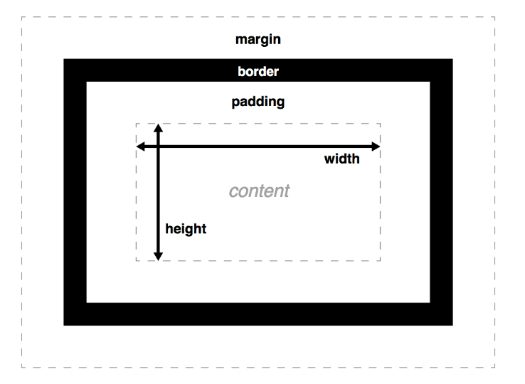
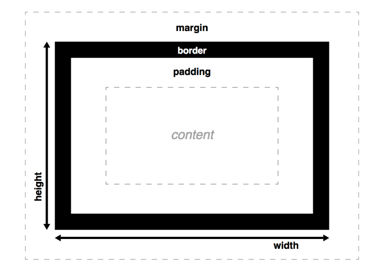

# CSS 样式化区块

-   [盒子模型](#盒子模型)
    -   [overflow](#overflow)
    -   [背景裁剪](#背景裁剪)
    -   [轮廓](#轮廓)
    -   [设置宽高的约束](#设置宽高的约束)
    -   [改变盒模型](#改变盒模型)

## 盒子模型



-   默认情况下 background-color/background-image 延伸到了 border 的外边缘。通过 background-clip 属性来改变
-   如果 content 框变得比示例输出窗口大，它将从窗口溢出，此时会出现滚动条，通过 overflow 来控制溢出
-   **框的高度不遵守百分比的长度；框的高度总是采用框内容的高度，除非指定一个绝对的高度（如：px 或者 em）**，它会比在页面上默认是 100%高度更实用
-   border 也忽略百分比宽度设置
-   外边距（margin）有一个特殊的行为，称为**外边距塌陷：当两个盒子挨在一起时，二者之间的距离为两个挨着的外边距中最大的那个值，而不是二者的和**

### overflow

-   当你使用绝对的值设置了一个框的大小（如，固定像素的宽/高），允许的大小可能不适合放置内容，这种情况下内容会从盒子溢流,使用 overflow 属性来控制这种情况的发生
    -   **auto**: 当内容过多，溢流的内容被隐藏，然后出现滚动条来让我们滚动查看所有的内容
    -   **hidden**: 当内容过多，溢流的内容被隐藏
    -   **visible**: 当内容过多，溢流的内容被显示在盒子的外边

### 背景裁剪

-   框的背景是由颜色和图片组成的，它们堆叠在一起（background-color, background-image）。 它们被应用到一个盒子里，然后被画在盒子的下面。
-   **默认情况下，背景延伸到了 border 外沿**

```css
.default {
    background-clip: border-box;
}
.padding-box {
    background-clip: padding-box;
}
.content-box {
    background-clip: content-box;
}
```

### 轮廓

-   盒子的 outline 看起来像边框，但是它不是盒模型的一部分。它表现得像边框，但是是画在盒子之上，不会修改盒子的大小（具体来说，ouline 是画在边框之外，外边距区域之内）

### 设置宽高的约束

-   max-width, max-height,min-height,min-width

```css
/*长度为宽度的比例*/
width: 70%;
max-width: 1280px;
min-width: 480px;
/*0会使顶部和底部边距为0，而 auto（在这种情况下）共享父容器左右边距之间的可用空间使它居中*/
margin: 0 auto;

/*当父容器在最小和最大宽度限制内时，它将填满整个视口宽度*/
/*当父容器超过1280px宽度时，布局将保持在1280px宽，并开始在可用空间内居中*/
/*当宽度低于480px时，视口将小于容器，您必须滚动才能看得到完全的内容*/
```

-   max-width 的另一个很好的用法是将媒体（例如图像和视频）限制在容器内部

```css
/*前两条样式规则可以使它的展示行为像一个块元素并且在父容器内居中*/
display: block;
margin: 0 auto;
/*限制了图像的宽度使它的最大宽度与父容器的宽度相等*/
max-width: 100%;
```

### 改变盒模型

-   box-sizing

    -   content-box
    -   border-box

-   border-box


