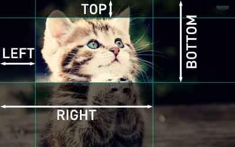

# CSS

## 定位

### top right bottom left

```css
top: auto | <length> | <percentage>
```

- 其中%的话，是按离其最近的有定位属性的祖先元素的**内容高+padding值来计算的，与border无关**

### position

- [CSS position 相对定位和绝对定位](https://www.runoob.com/w3cnote/css-position-static-relative-absolute-fixed.html)

#### static

- 对象遵循常规流。忽略 top, bottom, left, right 或者 z-index 声明

#### relative

- 定位是相对于其正常位置进行定位
- **设置了relative的元素仍然处在文档流中，元素的宽高不变，设置偏移量也不会影响其他元素的位置。**
- **最外层容器设置为relative定位，在没有设置宽度的情况下，宽度是整个浏览器的宽度**

#### absolute

- **定位是相对于离元素最近的设置了绝对或相对定位的父元素决定的**，如果没有父元素设置绝对或相对定位，则元素相对于根元素即html元素定位。
- **设置了absolute的元素脱离了文档流,元素在没有设置宽度的情况下，宽度由元素里面的内容决定**。脱离后原来的位置相当于是空的，下面的元素会来占据位置

#### fixed

- 与absolute一致，但偏移定位是以窗口为参考。当出现滚动条时，对象不会随着滚动

#### sticky

- 对象在常态时遵循常规流。
- 它就像是relative和fixed的合体，当在屏幕中时按常规流排版，当卷动到屏幕外时则表现如fixed。该属性的表现是现实中你见到的吸附效果。（CSS3）

### clip

```css
clip：auto | <shape>
clip: rect(<top>, <right>, <bottom>, <left>);
```



- 依据上-右-下-左的顺序**提供相对自身左上角为(0,0)坐标计算的四个偏移数值**，其中任一数值都可用auto替换，即此边不剪切

## 布局

### display

- [css中的display](https://www.css88.com/book/css/properties/layout/display.htm)

#### display:none

- 相当于Android中的View.GONE
- visibility:hidden相当于Android中的View.INVISIBLE

#### display:block display:inline

- 块级元素特点：
    - 总是以一个块的形式表现出来，占领一整行。若干同级块元素会从上之下依次排列（使用float属性除外）。
    - **可以设置高度、宽度、各个方向外补丁（margin）以及各个方向的内补丁（padding）**。
    - 当宽度（width）缺省时，它的宽度时其容器的100%，除非我们给它设定了固定的宽度。
    - 块级元素中可以容纳其他块级元素或行内元素。
    - 常见的块级元素由&lt;p&gt;&lt;div&gt;&lt;h1&gt;&lt;li&gt;等等。
    - 块级元素的display属性值默认为block。
　　
- 行内元素特点：
    - 它不会单独占据一整行，而是只占领自身的宽度和高度所在的空间。若干同级行内元素会从左到右（即某个行内元素可以和其他行内元素共处一行），从上到下依次排列。
    - 行内元素不可以设置高度、宽度，其高度一般由其字体的大小来决定，其宽度由内容的长度控制。
    - 行内元素**只能设置左右的margin值和左右的padding值，而不能设置上下的margin值和上下的padding值。因此我们可以通过设置左右的padding值来改变行内元素的宽度。**
    - 常见的行内元素由&lt;a&gt;&lt;em&gt;&lt;img&gt;等等。
    - 行内元素一般不可以包含块级元素。
    - 块级元素的display属性值默认为inline

- **通过对一个行内元素设置display:block;可以将行内元素设置为块级元素，进而设置它的宽高和上下左右的padding和margin**

```html
    <style type="text/css">
        * {
            padding: 0;
            margin: 0;
            list-style: none;
        }

        .nav_ul_li {
            float: left;
        }

        .nav_a {
            display: block;
            width: 30px;
            height: 30px;
            background: yellow;
            margin: 5px;
            text-decoration: none;
            text-align: center;
            line-height: 30px;
        }
    </style>

<ul>
    <li class="nav_ul_li"><a class="nav_a" href="https://www.baidu.com">1</a></li>
    <li class="nav_ul_li"><a class="nav_a" href="https://www.baidu.com">2</a></li>
    <li class="nav_ul_li"><a class="nav_a" href="https://www.baidu.com">3</a></li>
    <li class="nav_ul_li"><a class="nav_a" href="https://www.baidu.com">4</a></li>
    <li class="nav_ul_li"><a class="nav_a" href="https://www.baidu.com">5</a></li>
</ul>
```

#### display:inline-block

- 设置了inline-block属性的元素**既具有block元素可以设置width和height属性的特性，又保持了inline元素不换行的特性**

## Margin

```css
margin：[ <length> | <percentage> | auto ]{1,4}
```

- auto：水平（默认）书写模式下，margin-top/margin-bottom计算值为0，**margin-left/margin-right取决于可用空间**

### margin折叠

- [深入理解CSS外边距折叠（Margin Collapse）](https://tech.youzan.com/css-margin-collapse/)

## Padding

```css
padding：[ <length> | <percentage> ]{1,4}
```

- percentage,用百分比来定义内补白。水平（默认）书写模式下，参照其包含块 width 进行计算，其它情况参照 height 。不允许负值