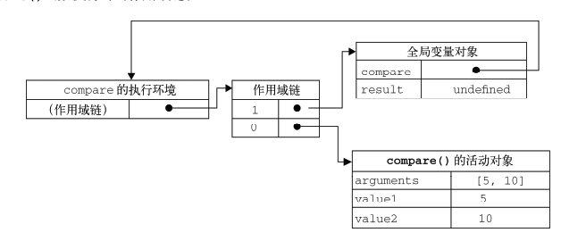
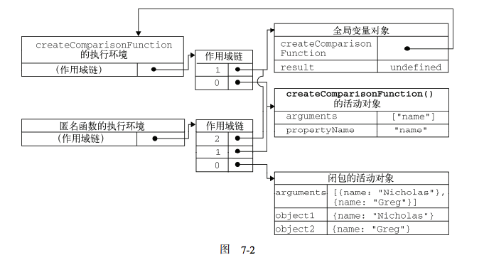

# 函数表达式

- [递归](#递归)
- [执行环境与作用域](#执行环境与作用域)
- [闭包](#闭包)
    - [作用域链](#作用域链)
    - [闭包与变量](#闭包与变量)
    - [关于this对象](#关于this对象)
    - [模仿块级作用域](#模仿块级作用域)
    - [私有变量](#私有变量)
        - [在构造函数中定义特权方法](#在构造函数中定义特权方法)
        - [静态私有变量](#静态私有变量)
    - [模块模式](#模块模式)
    - [增强的模块模式](#增强的模块模式)


**函数声明**
- 它的一个重要特征就是函数声明提升（function declaration hoisting），意思是在执行代码之前会先读取函数声明

```js
// 运行并没有任何问题
sayHi();
function sayHi(){
    alert("Hi!");
}
```

- **函数表达式**
    - 函数表达式与其他表达式一样，在使用前必须先赋值

```js
sayHi(); //错误：函数还不存在
var sayHi = function(){
    alert("Hi!");
};
```

```js
//不要这样做！
if(condition){
    function sayHi(){
        alert("Hi!");
    }
} else {
    function sayHi(){
        alert("Yo!");
    }
}

//可以这样做
var sayHi;
if(condition){
    sayHi = function(){
        alert("Hi!");
    };
} else {
    sayHi = function(){
        alert("Yo!");
    };
}
```

## 递归

```js
function factorial(num){
    if (num <= 1){
        return 1;
    } else {
        return num * factorial(num-1);
    }
}

// 出错的情况
var anotherFactorial = factorial;
factorial = null;
alert(anotherFactorial(4));
```

- **非严格模式下，可以使用arguments.callee**

```js
function factorial(num){
    if (num <= 1){
        return 1;
    } else {
        return num * arguments.callee(num-1);
    }
}
```

- 严格模式下，不能通过脚本访问 arguments.callee，访问这个属性会导致错误
- **使用命名函数表达式**

```js
// 解决办法
// 定义一个命名的函数表达式f(),然后将其赋值给factorial
var factorial = (function f(num){
    if (num <= 1){
        return 1;
    } else {
        return num * f(num-1);
    }
});
```

## 执行环境与作用域

- 执行环境定义了变量或函数有权访问的其他数据，决定了它们各自的行为
- 每个执行环境都有一个与之关联的**变量对象（variable object）**，环境中定义的所有变量和函数都保存在这个对象中
- 全局执行环境是最外围的一个执行环境，在 Web 浏览器中，全局执行环境被认为是 window 对象
- **每个函数都有自己的执行环境。当执行流进入一个函数时，函数的环境就会被推入一个环境栈中。而在函数执行之后，栈将其环境弹出，把控制权返回给之前的执行环境**
- 当代码在一个环境中执行时，会创建变量对象的一个**作用域链（scope chain）**。作用域链的用途，是保证对执行环境有权访问的所有变量和函数的有序访问。
- **作用域链的前端，始终都是当前执行的代码所在环境的变量对象**。如果这个环境是函数，则将其**活动对象（activation object）**作为变量对象。
- 活动对象在最开始时只包含一个变量，即 arguments 对象（这个对象在全局环境中是不存在的）。作用域链中的下一个变量对象来自包含（外部）环境，而再下一个变量对象则来自下一个包含环境。这样，一直延续到全局执行环境；全局执行环境的变量对象始终都是作用域链中的最后一个对象

## 闭包

- 创建一个函数并将它赋值给变量 functionName，这种情况下创建的函数叫做**匿名函数（anonymous function），因为 function 关键字后面没有标识符**。（匿名函数有时候也叫拉姆达函数。）匿名函数的 name 属性是空字符串

```js
var functionName = function(arg0, arg1, arg2){
    //函数体
};
```

- **闭包是指有权访问另一个函数作用域中的变量的函数,创建闭包的常见方式，就是在一个函数内部创建另一个函数**

```js
function createComparisonFunction(propertyName) {
    return function(object1, object2) {
        var value1 = object1[propertyName];
        var value2 = object2[propertyName];

        if (value1 < value2){
            return -1;
        } else if (value1 > value2){
            return 1;
        } else {
            return 0;
        }
    };
}
// 即使这个内部函数被返回了，而且是在其他地方被调用了，但它仍然可以访问变量 propertyName。
// 之所以还能够访问这个变量，是因为内部函数的作用域链中包含
// createComparisonFunction()的作用域
```

### 作用域链

- 当某个函数被调用时，会创建一个执行环境（execution context）及相应的作用域链。
- 使用 arguments 和其他命名参数的值来初始化函数的活动对象（activation object）。
- 但在作用域链中，外部函数的活动对象始终处于第二位，外部函数的外部函数的活动对象处于第三位，……直至作为作用域链终点的全局执行环境

```js
function compare(value1, value2){
    if (value1 < value2){
        return -1;
    } else if (value1 > value2){
        return 1;
    } else {
        return 0;
    }
}
var result = compare(5, 10);
```



```js
function createComparisonFunction(propertyName) {
    return function(object1, object2) {
        var value1 = object1[propertyName];
        var value2 = object2[propertyName];

        if (value1 < value2){
            return -1;
        } else if (value1 > value2){
            return 1;
        } else {
            return 0;
        }
    };
}

//创建函数
var compareNames = createComparisonFunction("name");
//调用函数
var result = compareNames({ name: "Nicholas" }, { name: "Greg" });
//解除对匿名函数的引用（以便释放内存）
compareNames = null;
```



- 在闭包函数被销毁之前，其外部函数的作用域链会被销毁，但是它的活动对象仍然会保持在内存中

### 闭包与变量

- **作用域链的这种配置机制引出了一个值得注意的副作用，即闭包只能取得包含函数中任何变量的最后一个值**。别忘了闭包所保存的是整个变量对象，而不是某个特殊的变量

```js
function createFunctions(){
    var result = new Array();
    for (var i=0; i < 10; i++){
        result[i] = function(){
            return i;
        };
    }
    return result;
}

// 这个函数会返回一个函数数组。
// 似乎每个函数都应该返自己的索引值，即位置 0 的函数返回 0，位置 1 的函数返回 1，
// 以此类推。但实际上，每个函数都返回 10。
// 因为每个函数的作用域链中都保存着createFunctions()函数的活动对象，所以它们引用的都是同一个变量 i。
// 当createFunctions()函数返回后，变量i的值是 10，此时每个函数都引用着保存变量i的同一个变量对象，所以在每个函数内部 i 的值都是 10
```

```js
function createFunctions(){
    var result = new Array();
    for (var i=0; i < 10; i++) {
        // 其原理是使用函数参数传递，使用的是值传递
        result[i] = function(num){
            return function(){
                return num;
            };
        }(i);
    }
    return result;
}
```

### 关于this对象

- [深入理解javascript原型和闭包（10）——this](https://www.cnblogs.com/wangfupeng1988/p/3988422.html)
- [JS中this关键字详解](https://www.cnblogs.com/lisha-better/p/5684844.html)

- **this对象是在运行时基于函数的执行环境绑定的**：在全局函数中，this 等于 window，而当函数被作为某个对象的方法调用时，this 等于那个对象。
- **匿名函数的执行环境具有全局性，因此其 this 对象通常指向 window**
- **每个函数在被调用时都会自动取得两个特殊变量：this 和 arguments。内部函数在搜索这两个变量时，只会搜索到其活动对象为止，因此永远不可能直接访问外部函数中的这两个变量**

```js
var name = "The Window";

var object = {
    name : "My Object",
    getNameFunc : function(){
        return function(){
            return this.name;
        };
    }
};

// 具体调用相当于
// var f = object.getNameFunc();
// f();
alert(object.getNameFunc()()); //"The Window"（在非严格模式下）
```

- **把外部作用域中的 this 对象保存在一个闭包能够访问到的变量里，就可以让闭包访问该对象了**
- **this 和 arguments 也存在同样的问题。如果想访问作用域中的 arguments 对象，必须将对该对象的引用保存到另一个闭包能够访问的变量中。**

```js
var name = "The Window";
var object = {
    name : "My Object",
    getNameFunc : function(){
        // 这里实际上是一个闭包
        // 作用域链 内部匿名函数-》getNameFunc的活动对象-》全局作用域
        // 在内部能够引用getNameFunc的活动对象，也用能够访问that,也用间接可以调用外部的对象
        var that = this;
            return function(){
                return that.name;
            };
        }
};
alert(object.getNameFunc()()); //"My Object"
```

```js
var name = "The Window";
var object = {
    name : "My Object",
    getName: function(){
        return this.name;
    }
};

object.getName(); //"My Object"
(object.getName)(); //"My Object"
(object.getName = object.getName)(); //"The Window"，在非严格模式下
```

### 模仿块级作用域

- js中在块语句中定义的变量，实际上是在包含函数中而非语句中创建的

```js
function outputNumbers(count){
    for (var i=0; i < count; i++){
        alert(i);
    }
    // 在这里仍然能够访问在for语句中定义的变量i
    alert(i); //计数
}
```

- 使用函数表达式模仿块级作用域,**一定要加上括号**
- 在匿名函数中定义的任何变量，都会在执行结束后销毁

```js
(function(){
    //这里是块级作用域
})();

function outputNumbers(count){
    (function () {
        for (var i=0; i < count; i++){
            alert(i);
        }
    })();

    alert(i); //导致一个错误！
}
```

- **这种技术经常在全局作用域中被用在函数外部，从而限制向全局作用域中添加过多的变量和函数**
- **这种做法可以减少闭包占用的内存问题，因为没有指向匿名函数的引用。只要函数执行完毕，就可以立即销毁其作用域链了**

```js
(function(){
    var now = new Date();
    if (now.getMonth() == 0 && now.getDate() == 1){
        alert("Happy new year!");
    }
})();
```

### 私有变量

- JavaScript 中没有私有成员的概念；所有对象属性都是公有的。
- 倒是有一个私有变量的概念。任何在函数中定义的变量，都可以认为是私有变量，因为不能在函数的外部访问这些变量。
- **私有变量包括函数的参数、局部变量和在函数内部定义的其他函数**
- 把有权访问私有变量和私有函数的公有方法称为特权方法

#### 在构造函数中定义特权方法

```js
function MyObject(){
    //私有变量和私有函数
    var privateVariable = 10;
    function privateFunction(){
        return false;
    }

    // 特权方法
    // 因为特权方法作为闭包有权访问构造函数中定义的所有变量与函数
    this.publicMethod = function (){
        privateVariable++;
        return privateFunction();
    };
}

// 这里的私有成员甚至使用的是函数调用参数
function Person(name){
    this.getName = function(){
        return name;
    };

    this.setName = function (value) {
        name = value;
    };
}
var person = new Person("Nicholas");
alert(person.getName()); //"Nicholas"
person.setName("Greg");
alert(person.getName()); //"Greg"
```

#### 静态私有变量

- 在构造函数中定义特权方法也有一个缺点，**就是必须使用构造函数模式来达到这个目的，间接的使每个实例都会创建一组新方法**
- 静态私有变量
    - 创建一个私有作用域
    - 定义私有变量与私有函数
    - 定义构造函数与公有方法，
        - **定义构造函数时使用函数表达式，而不是函数声明**
        - MyObject前没有加var关键字，初始化未经声明的变量，总是会创建一个全局变量
        - MyObject 就成了一个全局变量，能够在私有作用域之外被访问到
        - 在严格模式下给未经声明的变量赋值会导致错误

```js
(function(){
    //私有变量和私有函数
    var privateVariable = 10;
    function privateFunction(){
        return false;
    }

    //构造函数
    MyObject = function(){
    };

    //公有/特权方法
    MyObject.prototype.publicMethod = function(){
        privateVariable++;
        return privateFunction();
    };
})();
```

- **静态私有变量方法的好处是，因为使用原型面增加代码复用，缺点是每个实例都没有自己的私有变量**

```js
(function(){

    var name = "";

    Person = function(value){
        name = value;
    };

    Person.prototype.getName = function(){
        return name;
    };

    Person.prototype.setName = function (value){
        name = value;
    };
})();

var person1 = new Person("Nicholas");
alert(person1.getName()); //"Nicholas"
person1.setName("Greg");
alert(person1.getName()); //"Greg"

var person2 = new Person("Michael");
alert(person1.getName()); //"Michael"
alert(person2.getName()); //"Michael"
```

### 模块模式

- **模块模式（module pattern）则是为单例创建私有变量和特权方法**

```js
// 使用字面量的方式来创建单例对象
var singleton = {
    name : value,
    method : function () {
        //这里是方法的代码
    }
};
```

- 模块模式通过为单例添加私有变量和特权方法能够使其得到增强

```js
var singleton = function(){
    //私有变量和私有函数
    var privateVariable = 10;

    function privateFunction(){
        return false;
    }

    // 特权/公有方法和属性
    // 这个对象字面量定义的是单例的公共接口
    // 在需要对单例进行某些初始化，同时又需要维护其私有变量时是非常有用的
    return {
        publicProperty: true,
        publicMethod : function(){
            privateVariable++;
            return privateFunction();
        }
    };
}();
```

```js
var application = function(){
    //私有变量和函数
    var components = new Array();

    //初始化
    components.push(new BaseComponent());

    //公共
    return {
        getComponentCount : function(){
            return components.length;
        },

        registerComponent : function(component){
            if (typeof component == "object"){
                components.push(component);
            }  
        }
 };
}();
```

### 增强的模块模式

- 即在返回对象之前加入对其增强的代码。这种增强的模块模式适合那些单例必须是某种类型的实例，同时还必须添加某些属性和（或）方法对其加以增强的情况

```js
var singleton = function(){
    //私有变量和私有函数
    var privateVariable = 10;
    function privateFunction(){
        return false;
    }

    //创建对象
    var object = new CustomType();
    //添加特权/公有属性和方法
    object.publicProperty = true;
    object.publicMethod = function(){
        privateVariable++;
    return privateFunction();
    };

    //返回这个对象
    return object;
}();
```

```js
// application必须是BaseComponet的实例
var application = function(){
    //私有变量和函数
    var components = new Array();

    //初始化
    components.push(new BaseComponent());

    //创建 application 的一个局部副本
    var app = new BaseComponent();
    //公共接口
    app.getComponentCount = function(){
        return components.length;
    };
    app.registerComponent = function(component){
        if (typeof component == "object"){
            components.push(component);
        }
    };

    //返回这个副本
  return app;
}();
```