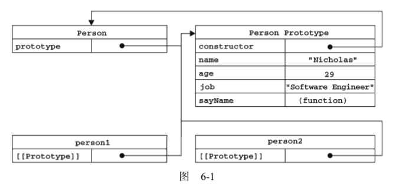
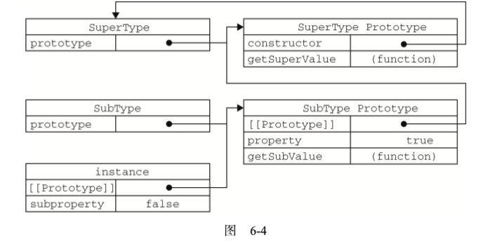
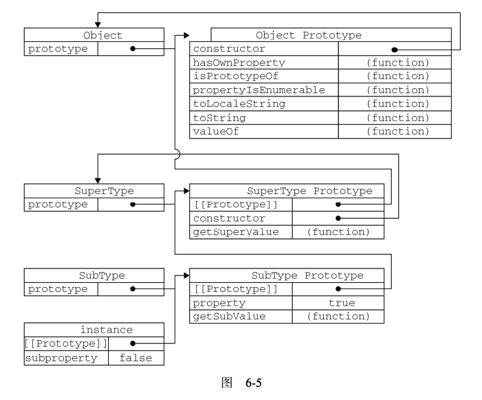
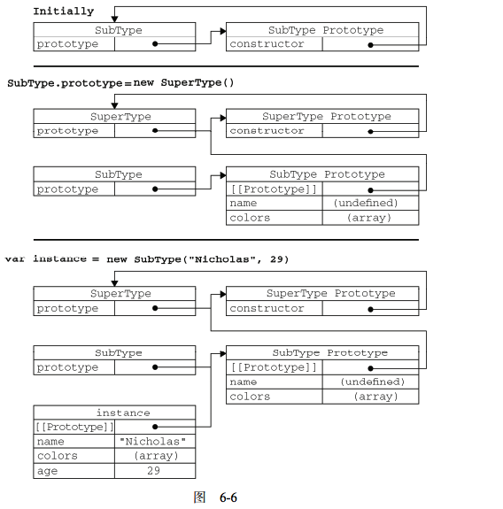

# 面向对象

- [属性类型](#属性类型)
    - [访问器属性](#访问器属性)
    - [定义多个属性](#定义多个属性)
    - [读取属性的特性](#读取属性的特性)
- [创建对象](#创建对象)
    - [工厂模式](#工厂模式)
    - [构造函数模式](#构造函数模式)
    - [原型模式](#原型模式)
        - [理解原型对象](#理解原型对象)
        - [属性的查找](#属性的查找)
        - [原型 与 in](#原型-与-in)
        - [更简单的原型语法](#更简单的原型语法)
        - [原型的动态性](#原型的动态性)
        - [原生对象的原型](#原生对象的原型)
        - [原型创建对象的问题](#原型创建对象的问题)
        - [组合使用构造函数模式和原型模式](#组合使用构造函数模式和原型模式)
        - [动态原型模式](#动态原型模式)
        - [寄生构造函数模式](#寄生构造函数模式)
        - [稳妥构造函数模式](#稳妥构造函数模式)
- [继承](#继承)
    - [原型链](#原型链)
    - [确定原型和实例的关系](#确定原型和实例的关系)
    - [谨慎的定义方法](#谨慎的定义方法)
    - [原型链的问题](#原型链的问题)
    - [组合继承](#组合继承)
    - [原型式继承](#原型式继承)
    - [寄生式继承](#寄生式继承)
    - [寄生组合式继承](#寄生组合式继承)

## 属性类型

- **[[Configurable]]**:表示能否通过 delete 删除属性从而重新定义属性，能否修改属性的特性，或者能否把属性修改为访问器属性。像前面例子中那样直接在对象上定义的属性，它们的这个特性默认值为 true。
- **[[Enumerable]]**:表示能否通过 for-in 循环返回属性。像前面例子中那样直接在对象上定义的属性，它们的这个特性默认值为 true
- **[[Writable]]**:表示能否修改属性的值。像前面例子中那样直接在对象上定义的属性，它们的这个特性默认值为true
- **[[Value]]**:包含这个属性的数据值。读取属性值的时候，从这个位置读;写入属性值的时候，把新值保存在这个位置。这个特性的默认值为 undefined
- 要修改属性默认的特性，必须使用 ECMAScript 5 的 Object.defineProperty()方法
    - configurable
    - enumerable
    - writable
    - value

```typescript
// ts
interface PropertyDescriptor {
    configurable?: boolean;
    enumerable?: boolean;
    value?: any;
    writable?: boolean;
    get?(): any;
    set?(v: any): void;
}

var person = {};
Object.defineProperty(person, "name", {
    writable: false,
    value: "Nicholas"
});
alert(person.name); //"Nicholas"
person.name = "Greg";
alert(person.name); //"Nicholas"
```

- **一旦把属性定义为不可配置的， 就不能再把它变回可配置了**。此时，再调用 Object.defineProperty()方法修改除 writable 之外 的特性，都会导致错误
- 可以多次调用 Object.defineProperty()方法修改同一个属性，但在把 configurable 特性设置为 false 之后就会有限制了
- 在调用 Object.defineProperty()方法时，**如果不指定，configurable、enumerable 和 writable 特性的默认值都是 false**

```js
var person = {};
Object.defineProperty(person, "name", {
    configurable: false,
    value: "Nicholas"
});

//抛出错误
Object.defineProperty(person, "name", {
    configurable: true,
    value: "Nicholas"
});
```

### 访问器属性

- 访问器属性不包含数据值;它们包含一对儿 getter 和 setter 函数(不过，这两个函数都不是必需的)
- 在读取访问器属性时，会调用getter函数，这个函数负责返回有效的值;
- 在写入访问器属性时，会调用 setter 函数并传入新值，这个函数负责决定如何处理数据
    - [[Configurable]]:表示能否通过 delete 删除属性从而重新定义属性，能否修改属性的特性，或者能否把属性修改为数据属性。对于直接在对象上定义的属性，这个特性的默认值为 true。
    - [[Enumerable]]:表示能否通过 for-in 循环返回属性。对于直接在对象上定义的属性，这个特性的默认值为 true
    - [[Get]]:在读取属性时调用的函数。默认值为 undefined
    - [[Set]]:在写入属性时调用的函数。默认值为 undefined
- 访问器属性不能直接定义，必须使用 Object.defineProperty()来定义
- **下划线开头的属性，前面的下划线是一种常用的记号，用于表示只能通过对象方法访问的属性**
- 不一定要同时指定setter与getter

```js
var book = {
    // _year 前面 的下划线是一种常用的记号，用于表示只能通过对象方法访问的属性
    _year: 2004,
    edition: 1
};

Object.defineProperty(book, "year", {
    get: function(){
        return this._year;
    },
    set: function(newValue){
        if (newValue > 2004) {
            this._year = newValue;
            this.edition += newValue - 2004;
        }
    }
});

// 虽然没有直接的year属性，但是可以get/set设置读取属性
book.year = 2005;
alert(book.edition); //2
```

### 定义多个属性

- Object.defineProperties()

```js
    var book = {};
    Object.defineProperties(book, {
        _year: {
            value: 2004
        },
        edition: {
            value: 1
        },
        year: {
            get: function () {
                return this._year;
            },
            set: function (newValue) {
                if (newValue > 2004) {
                    this._year = newValue;
                    this.edition += newValue - 2004;
                }
            }
        }
    });
```

### 读取属性的特性

- 使用 ECMAScript 5 的 Object.getOwnPropertyDescriptor()方法，可以取得给定属性的描述符

```js
var descriptor = Object.getOwnPropertyDescriptor(book, "_year");
alert(descriptor.value); //2004
alert(descriptor.configurable); //false

alert(typeof descriptor.get); //"undefined"
var descriptor = Object.getOwnPropertyDescriptor(book, "year");
alert(descriptor.value); //undefined
alert(descriptor.enumerable); //false
alert(typeof descriptor.get); //"function"
```

## 创建对象

### 工厂模式

- 可以创建相似的对象，但无法判别类型

```js
function createPerson(name, age, job){
    var o = new Object();
    o.name = name;
    o.age = age;
    o.job = job;
    o.sayName = function(){
        alert(this.name);
    };
    return o;
}

var person1 = createPerson("Nicholas", 29, "Software Engineer");
var person2 = createPerson("Greg", 27, "Doctor");
```

### 构造函数模式

- 没有显式地创建对象
- 直接将属性和方法赋给了 this 对象
- 没有 return 语句
- 构造函数首字母大写
- **问题在于，就是每个方法都要在每个实例上重新创建一遍**

```js
function Person(name, age, job){
    this.name = name;
    this.age = age;
    this.job = job;
    this.sayName = function(){
        alert(this.name);
    };
    // 没有return语句
}

var person1 = new Person("Nicholas", 29, "Software Engineer");
var person2 = new Person("Greg", 27, "Doctor");
```

```js
// 当作构造函数使用
var person = new Person("Nicholas", 29, "Software Engineer");
person.sayName(); //"Nicholas"

// 作为普通函数调用
// 全局作用域调用函数，指向Global对象，也就是window对象
Person("Greg", 27, "Doctor"); // 添加到window
window.sayName(); //"Greg"

// 在另一个对象的作用域中调用
var o = new Object();
Person.call(o, "Kristen", 25, "Nurse");
o.sayName(); //"Kristen"
```

```js
function Person(name, age, job){
    this.name = name;
    this.age = age;
    this.job = job;
    this.sayName = new Function("alert(this.name)"); // 与声明函数在逻辑上是等价的
}

var person1 = createPerson("Nicholas", 29, "Software Engineer");
var person2 = createPerson("Greg", 27, "Doctor");

// 两个不同对象上的sayName实际不是同一个对象
alert(person1.sayName == person2.sayName);  //false
```

```js
function Person(name, age, job){
    this.name = name;
    this.age = age;
    this.job = job;
    this.sayName = sayName;
}
function sayName(){
    alert(this.name);
}

// 现在两个对象的sayName是同一个对象
var person1 = new Person("Nicholas", 29, "Software Engineer");
var person2 = new Person("Greg", 27, "Doctor");
```

### 原型模式

- [JS中原型链中的prototype与_proto_的个人理解与详细总结](https://www.cnblogs.com/libin-1/p/6014925.html)
- [详解prototype与__proto__区别](https://blog.csdn.net/ligang2585116/article/details/53522741)

#### 理解原型对象

- 无论什么时候，**只要创建了一个新函数，就会根据一组特定的规则为该函数创建一个prototype属性**，这个属性指向函数的原型对象
- 所有原型对象都会自动获得一个constructor属性，这个属性包含一个指向prototype属性所在函数的指针

```js
function Person() {
}

// 函数的prototype属性
// 函数的prototype的constructor指向函数本身
console.log(Person.prototype.constructor === Person);  // true
```



- 当调用构造函数创建一个新实例后，该实例的内部将包含一个指针(内部属性)，指向构造函数的原型对象,ECMA-262第5版中管这个指针叫[[Prototype]],在具体的实现上,一般这个指针被命名为__proto__，为了兼容一般用Object.setPrototypeOf()（写操作）、Object.getPrototypeOf()（读操作）、Object.create()（生成操作）代替操作这个__proto__属性
- **每个构造函数都具有一个名为prototype的对象属性**，既然是对象属性，**所以prototype同样带有__proto__属性**
- **每个对象的__proto__属性指向自身构造函数的prototype**
- 由同一个构造函数构造的对象，共享相同的__proto__,也就是其构造函数的prototype


```js
    // 构造函数
    function Fun() {
    }

    // 对象
    var fn = new Fun();

    // 对象的__proto__=其构造函数的prototype
    log(Object.getPrototypeOf(fn) === Fun.prototype);                   // true

    // Fun是函数，所以其__proto__为其构造函数Function()的prototype,当然也不是Fun.prototype
    log(Object.getPrototypeOf(Fun) === Fun.prototype);                  // false
    log(Object.getPrototypeOf(Fun) === Function.prototype);             // true

    // Function是一个函数，函数的原型为构造函数Function()的原型
    log(Object.getPrototypeOf(Function) === Object.prototype);          // false
    log(Object.getPrototypeOf(Function) === Function.prototype);        // true


    // Fun.prototype也是一个对象，其原型应当是Object.prototype
    log(Object.getPrototypeOf(Fun.prototype) === Function.prototype);   // false
    log(Object.getPrototypeOf(Fun.prototype) === Object.prototype);     // true
    // Function.prototype 是一个对象，其原型是其构造函数Object()的prototype
    // 所有构造函数的prototype的__proto__都指向了Object.prototype
    // 除了Object.__proto__指向的是Function.prototype
    log(Object.getPrototypeOf(Function.prototype) === Object.prototype); //true
    log(Object.getPrototypeOf(Object) === Function.prototype);           // true
    log(Object.getPrototypeOf(Object.prototype) == null)                 // true
```

- 总结：
    - prototype是函数独有的属性
    - 对象的__proto__属性通常与其构造函数的prototype属性相互对应
    - 除了Object.prototype的__proto__指向null, 其它所有构造函数的的prototype方法的__proto__指向Object.prototype；
    - Function的__proto__指向其构造函数Function()的prototype,也就是Function.prototype
    - Object作为一个构造函数(是一个函数对象!!函数对象!!),所以他的__proto__指向Function.prototype；
    - Function.prototype的__proto__指向其构造函数Object的prototype
    - Object.prototype的__proto__指向null；

- **isPrototypeOf**
    - isPrototypeOf是用来判断指定对象object1是否存在于另一个对象object2的原型链中，是则返回true，否则返回false。
    - 如果[[Prototype]]指向调用 isPrototypeOf()方法的对象 (Person.prototype)，那么这个方法就返回 true

```js
function Person() {
}

var p1 = new Person();
console.log(Person.prototype.isPrototypeOf(p1));
```

#### 属性的查找

- 每当代码读取某个对象的某个属性时，都会执行一次搜索，目标是具有给定名字的属性。
    - **搜索首先从对象实例本身开始**。如果在实例中找到了具有给定名字的属性，则返回该属性的值;
    - **如果没有找到，则继续搜索其__proto__，也就是在其构造函数的原型对象中查找具有给定名字的属性**
- **可以通过对象实例读取原型中的值，但却不能通过对象实例重写原型中的值**
- **可以通过原型读取与修改实例中的属性**

```js
function Foo(name) {
    this.thisName = name;
    this.sayAge = function () {
        console.log(this.age);
    };
    this.setAge = function () {
        this.age = "101";
    }
}

Foo.prototype.age = 1000;
Foo.prototype.thisName = "prototypeName";

Foo.prototype.sayName = function () {
    console.log(this.thisName);
};

Foo.prototype.writeName = function () {
    this.thisName = "writeName";
};

let f = new Foo("OriginName", 100);

// 查找优先实例属性
f.sayName();  // OriginName

// 原型属性
console.log(Object.getPrototypeOf(f).thisName); // prototypeName

// 修改也是优先修改实例属性
f.writeName();
f.sayName();  // writeName
console.log(Object.getPrototypeOf(f).thisName); // prototypeName

// 实例属性不存在，读取原型属性
f.sayAge();  // 1000

// 不可能使用实例修改原型中的值，实际上是给实例新增了一个age属性
f.setAge();

f.sayAge(); // 101

console.log(Object.getPrototypeOf(f).age); // 1000
```

- **如果我们在实例中添加了一个属性，而该属性与实例原型中的一个属性同名，那我们就在实例中创建该属性，该属性将会屏蔽原型中的那个属性**
- **当为对象实例添加一个属性时，这个属性就会屏蔽原型对象中保存的同名属性**;换句话说，添加这个属性只会阻止我们访问原型中的那个属性，但不会修改那个属性。即使将这个属性设置为 null，也只会在实例中设置这个属性，而不会恢复其指向原型的连接。- **使用delete 操作符则可以完全删除实例属性，从而让我们能够重新访问原型中的属性**

```js
function Person(){
}

Person.prototype.name = "Nicholas";
Person.prototype.age = 29;
Person.prototype.job = "Software Engineer";
Person.prototype.sayName = function(){
    alert(this.name);
};

var person1 = new Person();
var person2 = new Person();

person1.name = "Greg";
alert(person1.name); //"Greg"——来自实例
alert(person2.name); //"Nicholas"——来自原型

// delete删除实例属性
delete person1.name;
alert(person1.name); //"Nicholas"——来自原型
```

- hasOwnProperty(),可以检测一个属性是存在于实例中，还是存在于原型中。这个方法(不要忘了它是从Object继承来的)只在给定属性存在于对象实例中时，才会返回true

```js
fuction Person(){
}

Person.prototype.name = "Nicholas";
Person.prototype.age = 29;
Person.prototype.job = "Software Engineer";
Person.prototype.sayName = function(){
    alert(this.name);
 };

var person1 = new Person();
var person2 = new Person();
alert(person1.hasOwnProperty("name"));  //false
person1.name = "Greg";
alert(person1.name); //"Greg"——来自实例
alert(person1.hasOwnProperty("name")); //true
alert(person2.name); //"Nicholas"——来自原型
alert(person2.hasOwnProperty("name")); //false
delete person1.name;
alert(person1.name); //"Nicholas"——来自原型
alert(person1.hasOwnProperty("name")); //false
```

#### 原型 与 in

- 在单独使用时，**in 操作符会在通过对象能够访问给定属性时返回 true，无论该属性存在于实例中还是原型中**

```js
function hasPrototypeProperty(object, name){
    return !object.hasOwnProperty(name) && (name in object);
}

function Person(){
}
Person.prototype.name = "Nicholas";
Person.prototype.age = 29;
Person.prototype.job = "Software Engineer";
Person.prototype.sayName = function(){
    alert(this.name);
};

var person = new Person();
alert(hasPrototypeProperty(person, "name")); //true

person.name = "Greg";
alert(hasPrototypeProperty(person, "name")); //false
```

- for in的返回所有可枚举(enumerable为true的属性)
    - 自身属性返回
    - 原型属性返回
    - enumerable为false的属性不返回

- Object.keys返回实例自身的的可枚举(enumerable为true的属性)
    - 原型属性不返回
    - enumerable为false的属性不返回

- Object.getOwnPropertyNames返回自身的属性的名字集合
    - 原型属性不返回
    - enumerable为true,false都返回

```js
    function TestForIn() {
        this.a = 100;
    }

    TestForIn.prototype.b = "b";

    let testforin = new TestForIn();

    Object.defineProperty(testforin, "c", {
        enumerable : true,
        value : "c"
    });

    Object.defineProperty(testforin, "d", {
        enumerable : false,
        value : "d"
    });

    console.log(testforin.c);  // c
    console.log(testforin.d);  // d

    // 返回原型属性与实例属性，a b c
    // d因为enumerable为false 不返回
    console.log("for in :");
    for (let p in testforin) {
        console.log(p);
    }
    // a c b

    // b 不返回因为是原型属性
    // d 不返回因为enumerable为false
    let keys = Object.keys(testforin);
    console.log("Object.keys:");
    for (let key of keys) {
        console.log(key);
    }
    // a c

    // 只要是自身属性就返回
    // enumerable为false或true都返回
    let ownKeys = Object.getOwnPropertyNames(testforin);
    console.log("Object.getOwnPropertyNames:")
    for (let key of ownKeys) {
        console.log(key);
    }
    // a c d
```

#### 更简单的原型语法

```js
function Person(){
}
Person.prototype = {
    name : "Nicholas",
    age : 29,
    job: "Software Engineer",
    sayName : function () {
        alert(this.name);
    }
};

var friend = new Person();
alert(friend instanceof Object); //true
alert(friend instanceof Person); //true
// 上面没有指定constructor方法，所以这里返回false
alert(friend.constructor == Person); //false
alert(friend.constructor == Object); //true
```

- 如果 constructor 的值真的很重要，可以像下面这样特意将它设置回适当的值。
- 以这种方式重设 constructor 属性会导致它的[[Enumerable]]特性被设置为 true。默认情况下，原生的 constructor 属性是不可枚举的

```js
function Person(){
}
Person.prototype = {
    constructor : Person,
    name : "Nicholas",
    age : 29,
    job: "Software Engineer",
    sayName : function () {
        alert(this.name);
    }
};

//重设构造函数，只适用于 ECMAScript 5 兼容的浏览器
Object.defineProperty(Person.prototype, "constructor", {
    enumerable: false,
    value: Person
});
```

#### 原型的动态性

- 由于在原型中查找值的过程是一次搜索，**因此我们对原型对象所做的任何修改都能够立即从实例上反映出来——即使是先创建了实例后修改原型也照样如此**

```js
var friend = new Person();
Person.prototype.sayHi = function(){
    alert("hi");
};

// 先有对象，后有原型，没有问题
friend.sayHi(); //"hi"（没有问题！）
```

- 尽管可以随时为原型添加属性和方法，并且修改能够立即在所有对象实例中反映出来，但如果是重写整个原型对象，那么情况就不一样了。我们知道，**调用构造函数时会为实例添加一个指向最初原型的[[Prototype]]指针，而把原型修改为另外一个对象就等于切断了构造函数与最初原型之间的联系**

```js
function Person(){
}
var friend = new Person();

Person.prototype = {
    constructor: Person,
    name : "Nicholas",
    age : 29,
    job : "Software Engineer",
    sayName : function () {
        alert(this.name);
    }
};
// friend的__proto__属性是一个指针，指向调用构造函数时Person的prototype属性
// 后面重写了整个原型对象，但friend的__proto__属性指向不变
// 所以这里sayName属性
friend.sayName(); //error
```


#### 原生对象的原型

- 原型模式的重要性不仅体现在创建自定义类型方面，就连所有原生的引用类型，都是采用这种模式创建的。
- 通过原生对象的原型，不仅可以取得所有默认方法的引用，而且也可以定义新方法，**但不推荐给原生对象的原型添加方法**

```js
String.prototype.startsWith = function (text) {
 return this.indexOf(text) == 0;
};
var msg = "Hello world!";
alert(msg.startsWith("Hello")); //true
```

#### 原型创建对象的问题

- 原型中所有属性是被很多实例共享的，这种共享对于函数非常合适
- 对于那些包含基本值的属性倒也说得过去，**对于包含引用类型值的属性来说，问题就比较突出了**
- 实例一般都是要有属于自己的全部属性，这些属性不能被共享

```js
function Person(){
}
Person.prototype = {
    constructor: Person,
    name : "Nicholas",
    age : 29,
    job : "Software Engineer",
    friends : ["Shelby", "Court"],
    sayName : function () {
        alert(this.name);
    }
};
var person1 = new Person();
var person2 = new Person();
person1.friends.push("Van");
alert(person1.friends); //"Shelby,Court,Van"
alert(person2.friends); //"Shelby,Court,Van"
alert(person1.friends === person2.friends); //true
```

```js
function People() {
    var age = 1;
    this.age = 10;
}

People.age = 20;
People.prototype.age = 30;

var age = 1：age为局部变量；
this.age = 10：函数调用时，age为this指向对象的属性；
People.age = 20：构造函数的age变为20；
People.prototype.age = 30：原型添加age属性；
```

#### 组合使用构造函数模式和原型模式

- **构造函数模式用于定义实例属性，而原型模式用于定义方法和共享的属性**

```js
function Person(name, age, job){
 this.name = name;
 this.age = age;
 this.job = job;
 this.friends = ["Shelby", "Court"];
}
Person.prototype = {
 constructor : Person,
 sayName : function(){
 alert(this.name);
 }
}
var person1 = new Person("Nicholas", 29, "Software Engineer");
var person2 = new Person("Greg", 27, "Doctor");
person1.friends.push("Van");
alert(person1.friends); //"Shelby,Count,Van"
alert(person2.friends); //"Shelby,Count"
alert(person1.friends === person2.friends); //false
alert(person1.sayName === person2.sayName); //true
```

#### 动态原型模式

- 动态原型模式正是致力于解决这个问题的一个方案，**它把所有信息都封装在了构造函数中，而通过在构造函数中初始化原型（仅在必要的情况下），又保持了同时使用构造函数和原型的优点**
- **使用动态原型模式时，不能使用对象字面量重写原型，如果在已经创建了实例的情况下重写原型，那么就会切断现有实例与新原型之间的联系**

```js
function Person(name, age, job){
 //属性
    this.name = name;
    this.age = age;
    this.job = job;
 //方法
    if (typeof this.sayName != "function"){
        Person.prototype.sayName = function(){
            alert(this.name);
        };
    }
}
var friend = new Person("Nicholas", 29, "Software Engineer");
friend.sayName();
```

#### 寄生构造函数模式

- 在前述的几种模式都不适用的情况下，可以使用寄生（parasitic）构造函数模式。这种模式的基本思想是创建一个函数，该函数的作用仅仅是封装创建对象的代码，然后再返回新创建的对象

```js
function Person(name, age, job){
    var o = new Object();
    o.name = name;
    o.age = age;
    o.job = job;
    o.sayName = function(){
        alert(this.name);
    };
    return o;
}
var friend = new Person("Nicholas", 29, "Software Engineer");
friend.sayName(); //"Nicholas"
```

- 这个模式可以在特殊的情况下用来为对象创建构造函数。**假设我们想创建一个具有额外方法的特殊数组。由于不能直接修改 Array 构造函数，因此可以使用这个模式**

```js
function SpecialArray(){
    //创建数组
    var values = new Array();
    //添加值
    values.push.apply(values, arguments);
    //添加方法
    values.toPipedString = function(){
        return this.join("|");
    };

    //返回数组
    return values;
}
var colors = new SpecialArray("red", "blue", "green");
alert(colors.toPipedString()); //"red|blue|green"
```

#### 稳妥构造函数模式

- **所谓稳妥对象，指的是没有公共属性，而且其方法也不引用 this 的对象**
- 稳妥构造函数遵循与寄生构造函数类似的模式，但有两点不同：
    - **一是新创建对象的实例方法不引用 this**
    - **二是不使用 new 操作符调用构造函数**

```js
function Person(name, age, job){
    //创建要返回的对象
    var o = new Object();

    //可以在这里定义私有变量和函数
    //添加方法
    o.sayName = function(){
        alert(name);
    };

     //返回对象
    return o;
}

var friend = Person("Nicholas", 29, "Software Engineer");
friend.sayName(); //"Nicholas"
```

## 继承

### 原型链

- 让一个函数的prototype对象指向另一个函数类型的实例
- 以下示例中，**通过重写SubType的prototype指向SuperType的实例，实现继承**
- **SubType新增的方法与属性必须要在重写SubType的protoType之后**

```js
function SuperType(){
    this.property = true;
}

SuperType.prototype.getSuperValue = function(){
    return this.property;
};

function SubType(){
    this.subproperty = false;
}

// prototype指向SuperType的实例，来实现继承SuperType
SubType.prototype = new SuperType();

// 重写prototype指向后新增方法
SubType.prototype.getSubValue = function (){
    return this.subproperty;
};

var instance = new SubType();
alert(instance.getSuperValue()); //true
```



- SubType.prototype 现在是 SuperType的实例
- getSuperValue()是原型方法，仍然还在SuperType.prototype 中
- property 是一个实例属性，位于 SubType.prototype中，也就是SuperType的实例中
- **instance.constructor 现在指向的是 SuperType**，这是因为原来 SubType.prototype 中的 constructor 被重写了的缘故
- instance.getSuperValue()会经历三个搜索步骤：
    - 搜索实例
    - 搜索 SubType.prototype，也就是SuperType的实例
    - 搜索 SuperType.prototype，最后一步才会找到该方法。在找不到属性或方法的情况下，搜索过程总是要一环一环地前行到原型链末端才会停下来完整的



- SubType 继承了 SuperType，SuperType 继承了 Object

```js
    function SuperType() {
        this.superProperty = "superProperty"
    }

    SuperType.prototype.getSuperValue = function () {
        return this.superProperty;
    };

    function SubType() {
      this.subProperty = "subProperty";
    }

    SubType.prototype = new SuperType();
    SubType.prototype.getSubValue = function () {
        return this.subProperty;
    };

    let sub = new SubType();
    console.log(sub instanceof SubType);   // true
    console.log(sub instanceof SuperType); // true
    console.log(SubType.prototype.constructor === SuperType.prototype.constructor); // true
```

### 确定原型和实例的关系

- **instanceof** 操作符，主要用这个操作符来测试实例与原型链中出现过的构造函数

```js
alert(instance instanceof Object);    //true
alert(instance instanceof SuperType); //true
alert(instance instanceof SubType);   //true
```

- **isPrototypeOf()**,只要是原型链中出现过的原型，都可以说是该原型链所派生的实例的原型，因此 isPrototypeOf()方法也会返回 true

```js
alert(Object.prototype.isPrototypeOf(instance));    //true
alert(SuperType.prototype.isPrototypeOf(instance)); //true
alert(SubType.prototype.isPrototypeOf(instance));   //true
```

### 谨慎的定义方法

- 子类型有时候需要重写超类型中的某个方法，或者需要添加超类型中不存在的某个方法。**但不管怎样，给原型添加方法的代码一定要放在替换原型的语句之后,即在通过原型链实现继承时，不能使用对象字面量创建原型方法,因为这样做就会重写原型链**

```js
function SuperType() {
    this.superProperty = "superProperty"
}

SuperType.prototype.getSuperValue = function(){
 return this.property;
};
function SubType(){
 this.subproperty = false;
}
//继承了 SuperType
SubType.prototype = new SuperType();
//添加新方法
SubType.prototype.getSubValue = function (){
 return this.subproperty;
};
//重写超类型中的方法
SubType.prototype.getSuperValue = function (){
 return false;
};
var instance = new SubType();
alert(instance.getSuperValue()); //false
```

### 原型链的问题

- **包含引用类型值的原型属性会被所有实例共享**；而这也正是为什么要在构造函数中，而不是在原型对象中定义属性的原因
- **在通过原型来实现继承时，原型实际上会变成另一个类型的实例。原先的实例属性也就顺理成章地变成了现在的原型属性了**

```js
function SuperType(){
    this.colors = ["red", "blue", "green"];
}

function SubType(){
}

//继承了 SuperType
SubType.prototype = new SuperType();
var instance1 = new SubType();
instance1.colors.push("black");
alert(instance1.colors); //"red,blue,green,black"

var instance2 = new SubType();
alert(instance2.colors); //"red,blue,green,black"
```

- **原型链的第二个问题是：在创建子类型的实例时，不能向超类型的构造函数中传递参数,实际上，应该说是没有办法在不影响所有对象实例的情况下，给超类型的构造函数传递参数。**

### 组合继承

- 组合继承（combination inheritance），有时候也叫做伪经典继承，指的是将原型链和借用构造函数的技术组合到一块，从而发挥二者之长的一种继承模式。
- **其背后的思路是使用原型链实现对原型属性和方法的继承，而通过借用构造函数来实现对实例属性的继承**

```js
function SuperType(name){
 this.name = name;
 this.colors = ["red", "blue", "green"];
}

SuperType.prototype.sayName = function(){
    alert(this.name);
}

function SubType(name, age){
    //继承属性
    SuperType.call(this, name);
    this.age = age;
}
//继承方法
SubType.prototype = new SuperType();

SubType.prototype.constructor = SubType;
SubType.prototype.sayAge = function(){
    alert(this.age);
};

var instance1 = new SubType("Nicholas", 29);
instance1.colors.push("black");
alert(instance1.colors); //"red,blue,green,black"
instance1.sayName(); //"Nicholas";
instance1.sayAge(); //29

var instance2 = new SubType("Greg", 27);
alert(instance2.colors); //"red,blue,green"
instance2.sayName(); //"Greg";
instance2.sayAge(); //27
```

### 原型式继承

- 借助原型可以基于已有的对象创建新对象，同时还不必因此创建自定义类型
- 在 object()函数内部，先创建了一个临时性的构造函数，然后将传入的对象作为这个构造函数的原型，最后返回了这个临时类型的一个新实例。从本质上讲，object()对传入其中的对象执行了一次浅复制
- 在没有必要兴师动众地创建构造函数，而只想让一个对象与另一个对象保持类似的情况下，原型式继承是完全可以胜任的。
- 不过别忘了，**包含引用类型值的属性始终都会共享相应的值，就像使用原型模式一样**

```js
function object(o){
    function F(){}
    F.prototype = o;
    return new F();
}
```

```js
var person = {
    name: "Nicholas",
    friends: ["Shelby", "Court", "Van"]
};

var anotherPerson = object(person);
anotherPerson.name = "Greg";
anotherPerson.friends.push("Rob");

var yetAnotherPerson = object(person);
yetAnotherPerson.name = "Linda";
yetAnotherPerson.friends.push("Barbie");
alert(person.friends); //"Shelby,Court,Van,Rob,Barbie"
```

- ECMAScript 5 通过新增 Object.create()方法规范化了原型式继承。
    - 一个用作新对象原型的对象
    - （可选的）一个为新对象定义额外属性的对象

```js
var person = {
    name: "Nicholas",
    friends: ["Shelby", "Court", "Van"]
};

var anotherPerson = Object.create(person);
anotherPerson.name = "Greg";
anotherPerson.friends.push("Rob");

var yetAnotherPerson = Object.create(person);
yetAnotherPerson.name = "Linda";
yetAnotherPerson.friends.push("Barbie");
alert(person.friends); //"Shelby,Court,Van,Rob,Barbie"
```

```js
var person = {
    name: "Nicholas",
    friends: ["Shelby", "Court", "Van"]
};

var anotherPerson = Object.create(person, {
    name: {
        value: "Greg"
    }
});

alert(anotherPerson.name); //"Greg"
```

### 寄生式继承

- 寄生式继承的思路与寄生构造函数和工厂模式类似，即创建一个仅用于封装继承过程的函数，该函数在内部以某种方式来增强对象，最后再像真地是它做了所有工作一样返回对象
- 在主要考虑对象而不是自定义类型和构造函数的情况下，寄生式继承也是一种有用的模式,前面示范继承模式时使用的 object()函数不是必需的；任何能够返回新对象的函数都适用于此模式
- **使用寄生式继承来为对象添加函数，会由于不能做到函数复用而降低效率；这一点与构造函数模式类似**

```js
function createAnother(original){
    var clone = object(original); //通过调用函数创建一个新对象
    clone.sayHi = function(){ //以某种方式来增强这个对象
        alert("hi");
    };
    return clone; //返回这个对象
}
```

### 寄生组合式继承

- **组合继承最大的问题就是无论什么情况下，都会调用两次超类型构造函数**：一次是在创建子类型原型的时候，另一次是在子类型构造函数内部

```js
function SuperType(name){
    this.name = name;
    this.colors = ["red", "blue", "green"];
}

SuperType.prototype.sayName = function(){
    alert(this.name);
};

function SubType(name, age){
    SuperType.call(this, name); //第二次调用 SuperType()
    this.age = age;
}

SubType.prototype = new SuperType(); //第一次调用 SuperType()
SubType.prototype.constructor = SubType;
SubType.prototype.sayAge = function(){
    alert(this.age);
};
```

- **在第一次调用 SuperType 构造函数时，SubType.prototype 会得到两个属性**：name 和 colors；它们都是 SuperType 的实例属性，只不过现在位于 SubType 的原型中。
- **当调用 SubType 构造函数时，又会调用一次 SuperType 构造函数，这一次又在新对象上创建了实例属性 name 和 colors。于是，这两个属性就屏蔽了原型中的两个同名属性**



- 所谓寄生组合式继承，**即通过借用构造函数来继承属性，通过原型链的混成形式来继承方法**
- 其背后的基本思路是：**不必为了指定子类型的原型而调用超类型的构造函数，我们所需要的无非就是超类型原型的一个副本而已。本质上，就是使用寄生式继承来继承超类型的原型，然后再将结果指定给子类型的原型**

```js
function SuperType(name){
    this.name = name;
    this.colors = ["red", "blue", "green"];
}

SuperType.prototype.sayName = function(){
    alert(this.name);
};

function SubType(name, age){
    SuperType.call(this, name);
    this.age = age;
}

inheritPrototype(SubType, SuperType);

SubType.prototype.sayAge = function(){
    alert(this.age);
};

function inheritPrototype(subType, superType){
    var prototype = object(superType.prototype); //创建对象
    prototype.constructor = subType; //增强对象
    subType.prototype = prototype; //指定对象
}

function object(o){
    function F(){}
    F.prototype = o;
    return new F();
}
```

- 这个例子的高效率体现在它只调用了一次 SuperType 构造函数，**并且因此避免了在 SubType.prototype 上面创建不必要的、多余的属性。与此同时，原型链还能保持不变**；因此，还能够正常使用instanceof 和 isPrototypeOf()。开发人员普遍认为寄生组合式继承是引用类型最理想的继承范式

[[TOC]]